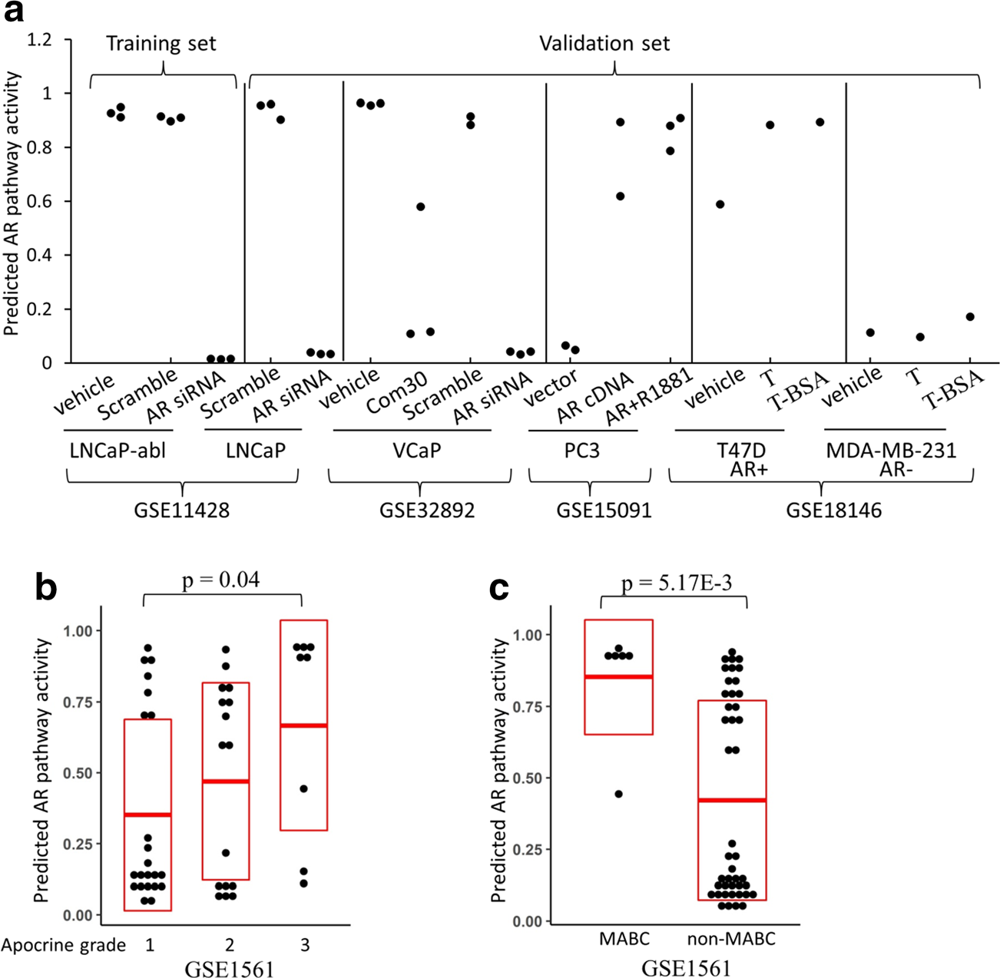
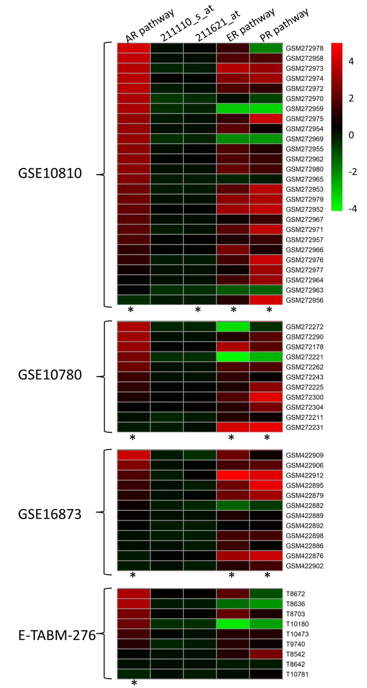
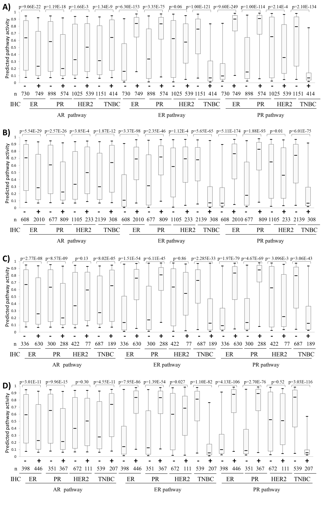
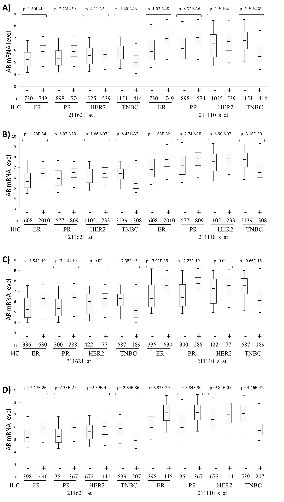
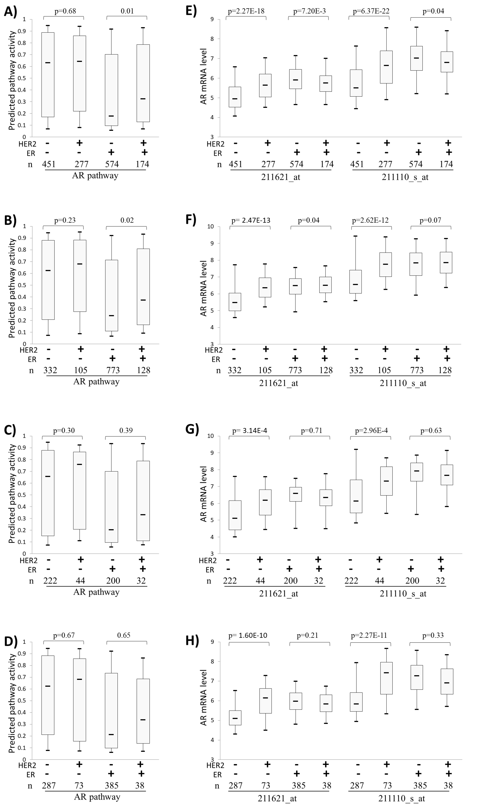
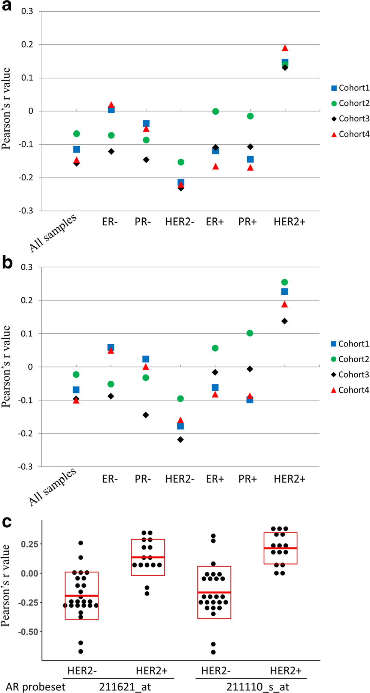

```python

```

**Dingxie Liu**<br>
Division of Endocrinology, Diabetes & Metabolism, Department of Medicine, <br> Johns Hopkins University School of Medicine,
Baltimore, MD 21287, USA


[Identification of a prognostic LncRNA signature for ER-positive, ER-negative and triple-negative breast cancers](https://pubmed.ncbi.nlm.nih.gov/32601968/)
<br><br>
[Concomitant dysregulation of the estrogen receptor and BRAF/MEK signaling pathways is common in colorectal cancer and predicts a worse prognosis](https://pubmed.ncbi.nlm.nih.gov/30645729/)<br><br>
[Gene signatures of estrogen and progesterone receptor pathways predict the prognosis of colorectal cancer](https://pubmed.ncbi.nlm.nih.gov/27376509/)
<br><br>
[PubMed](https://pubmed.ncbi.nlm.nih.gov/?cmd=search&term=Dingxie%20Liu)<br><br>
[Orchid](https://orcid.org/0000-0002-8061-5704)<br>


```python

```

- Androgen receptor (AR) antagonists are currently tested in multiple clinical trials for different breast cancer (BC)
subtypes
- AR expression was associated with a favorable prognosis in ER-positive BC
- The true biological effect of AR signaling in BC is not clear

**Methods**
- An AR pathway signature was generated to compute AR pathway activity in BCs (n = 6439) from 46 microarray datasets.
- Associations of AR pathway activity and AR expression with BC prognosis were compared by survival analysis

**Results:**
- AR pathway activity showed moderate positive and negative correlations with AR expression in HER2-positive and HER2-negative BCs, respectively.

- AR pathway activity increased while AR expression decreased in ER-negative BCs.

**Conclusions:**
Our findings encourage the continued evaluation of AR antagonists for BC treatment and support that AR pathway
activity serves as a better prognostic factor than AR expression in BC.


**Known Keys:**
    
- The AR is expressed in 60–80% of BCs, and its expression varies among subtypes <br><br>
- Approximately 90% of ERpositive BCs express AR, while only 40% of ER-negative BCs are AR-positive <br><br>
- AR expression has also been found to induce resistance to both tamoxifen and aromatase inhibitors (AI) in ER-positive BC cells, and treatment with anti-androgens has resulted in reversal of this resistance. <br><br>


```python

```

Currently, AR-positive status, which is detected by immunohistochemical (IHC) staining, is used as a biomarker for enrollment of BC patients in clinical trials for AR-targeted therapy.

However, the minimum percentage of cells positive for nuclear AR that should be considered as AR positive is still controversial.
In addition, there are no sufficient data to ascertain how well AR IHC results will correlate with measures of AR dependency and response to AR targeted therapy.
As studies showed that AR expression did not correlate well with actual AR pathway activity, we asked whether AR pathway activity may be a better prognostic or predictive factor than AR expression in BC


```python

```

### Materials and Methods
1. **Affymetrix microarray datasets (GEO)**
- More than 50 samples in the datasets.
   - Found 42 publicly available dataset
     -  30 datasets contained cancer recurrence information
     -  15 datasets contained neoadjuvant response information (3 datasets contained both)


2. **Merging of BC datasets into four patient cohorts**
- Merged datasets into four cohorts.
  - Cohort 1: 15 datasets that contained patient neoadjuvant response information.
  - Cohort 2: 16 datasets for which distant metastasis-free survival (DMFS) information was available.
  - Cohort 3: 8 datasets for which only relapse-free survival (RFS) information was available.
  - Cohort 4: 6 datasets that contained either RFS or DMFS information (these datasets have ashort follow-up time)
  
3. AR Pathway signature
- Dataset GSE11428 was used as training set with LNCaP-abl cells treated with AR-specific siRNA as `pathway off`
- LNCaP-abl cells treated with scrambled siRNA or vehicle as `pathway on`

4. Statistics
- Odds-ratios (OR) for the associations of clinical features with risk scores were calculated using logistic regression.
- Cox proportional hazards regression and Kaplan-Meier survival curves with log-rank test were used to analyze associations between risk scores and disease-free survival (DFS).

5. Receptor Status:
- The ER, PR and HER2 statuses of these BC samples were determined using IHC

For the patient cohorts that were merged from multiple individual datasets, the DFS time was censored at 8 years for cohort 2 and cohort 3, and at 5 years for cohort 4 since the datasets in this latter cohort contained shorter follow-up times

### Results
Through analysis of gene expression patterns of `LNCaPabl` cells treated with an AR-specific siRNA `(pathway “off”)` and cells with scrambled siRNA or vehicle `(pathway “on”)` by BinReg approach, 

- Using, `BinReg` approach, `100-probeset` expression signature for the `AR pathway` was generated.

- Among the 100 gene probesets, two probesets for AR genes `(211110_s_at` and `211621_at)` had the highest positive weight.

- That suggest AR expression level is most important positive factor for cellular pathway activity.





Fig. 1 Generation and validation of gene signatures for the AR pathway. 
- (a) Validation of the AR pathway signature in multiple cancer cell lines. Part of dataset GSE11428 was used as a training set. LNCaP-abl cells treated with AR-specific siRNA were set as AR pathway ‘off’, while LNCaP-abl cells treated with scrambled siRNA or vehicle as AR pathway ‘on’. The generated signature was then applied for prediction of AR pathway activity in the following validation sets:
  - (1) LNCaP cells treated with scrambled or AR-specific siRNA (GSE11428);
  - (2) Prostate cancer cell line VCaP treated with small molecule AR inhibitor (compound 30 or AR-siRNA (GSE32892); 
  - (3) AR-transfected PC3 cells treated with or without synthetic androgen methyltrienolone R1881 (GSE15091); and
  - (4) AR-positive T47D cells and AR-negative MDA-MB-231 BC cells treated with or without testosterone (T) or testosterone-BSA (T-BSA) (GSE18146). (b and c) Validation of AR pathway signature in clinical BC samples (GSE1561).

- The predicted AR pathway activities were compared among BCs with different apocrine histologic scores (b) or between MABC and non-MABC (c). Each dot represents one sample and the red crossbar represents mean ± S

#### 3.2 AR expression is decreased while AR pathway activity is increased in ER-negative BC

- AR pathway activity in four BC datasets
- The ER and PR pathway activities predicted by corresponding signatures were used as positive control


**`Upregulation of the AR pathway in BC was consistently observed among the four individual datasets and was more significant
than upregulation of the ER and PR pathways in BC`**

**`in contrast, AR mRNA level showed a moderate decrease in BC`**



**Associations of AR, ER and PR pathway activities with the immunohistochemistry (IHC) status of ER, PR and HER2 in BC**


**Figure: Associations of AR expression with the IHC status of ER, PR and HER2 in BC**



### AR pathway activity correlates positively with AR expression in HER2-positive BC but negatively in HER2-negative BC

- Both AR pathway activities and AR mRNA levels showed moderate increases in HER2-positive BCs
- Previously it has been reported that AR expression is positively associated with overexpression of HER2 in ER-negative but not ER-positive BC
- no such association was observed for AR pathway activity

**Figure: Associations of AR, ER and PR pathway activities with the immunohistochemistry (IHC) status of ER, PR and HER2 in BC. A) BC cohort 1. B) BC cohort 2. C) BC cohort 3. D) BC cohort 4**


```python

```

AR expression is upregulated in HER2-positive/ER-negative but not HER2-positive/ER-positive BC

AR pathway activity.



```python

```

Figure: AR pathway activity correlates with AR expression in a HER2- dependent manner in BC. 
- (a) Correlation between AR pathway activity and AR probeset 211621_at in four BC cohorts.
- (b) Correlation between AR pathway activity and AR probeset 211110_s_at in four BC cohorts. Pearson correlation analysis was performed in all BC samples or BCs with different ER, PR and HER2 expression statuses as indicated. The four BC cohorts were merged from 42 Affymetrix microarray datasets as described in Materials and methods.
- (c) Correlation of AR pathway activity with AR probesets 211621_at and 211110_s_at in unmerged individual BC datasets. In the 42 individual BC datasets, Pearson correlation analysis was performed only in the datasets containing ≥ 30 HER2-negative or ≥ 30 HER2-positive samples.



```python

```

**Figure: Associations of AR expression with the IHC status of ER, PR and HER2 in BC**.


```python

```


```python

```


```python

```


```python

```


```python

```


```python

```


```python

```


```python

```
