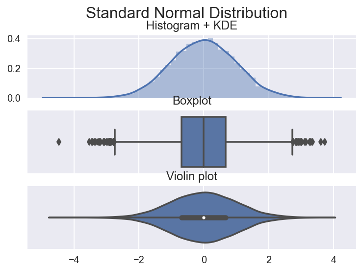
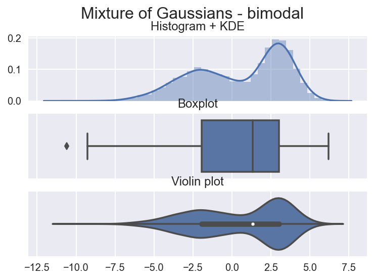
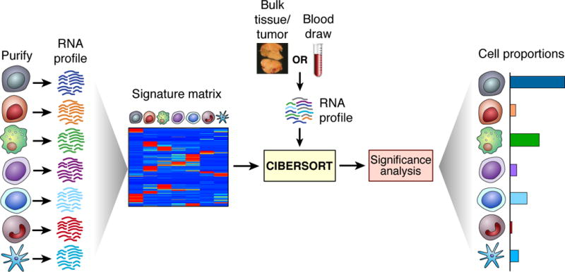
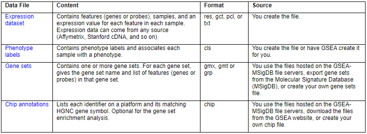

```python

```


```python
%load_ext watermark
from IPython.core.display import display, HTML
display(HTML("<style>.container {width:70% !important;}</style>"))
import matplotlib.pyplot as plt
import warnings
import numpy as np 
import seaborn as sns 
import pandas as pd

plt.style.use('seaborn')
plt.rcParams['figure.figsize'] = [16, 9]
plt.rcParams['figure.dpi'] = 200
warnings.simplefilter(action='ignore', category=FutureWarning)
```


```python
%matplotlib inline
%config InlineBackend.figure_format = 'retina'
```


```python

```


```python

```

### Violin Plots

In general, violin plots are a method of plotting numeric data and can be considered a combination of the box plot with a kernel density plot. In the violin plot we can find the same information as in the box plots:
* median (a white dot on the violin plot)
* interquartile range (the black bar in the center of violin)
* the adjacent values (the black lines stretched from the bar) - defined as `first quartile - 1.5 IQR` and `third quartile + 1.5 IQR` respectively. These values can be used in a simple outlier detection technique (Tukey's fences) - observations lying outside of these "fences" can be considered outliers.

The unquestionable advantage of the violin plot over the box plot is that aside from showing the abovementioned statistics it also shows the entire distribution of the data. This is of interest, especially when dealing with multimodal data, *i.e.*, a distribution with more than one peak.


```python
N = 10 ** 4
np.random.seed(42)
```


```python
def plot_comparison(x, title):
    fig, ax = plt.subplots(3, 1, sharex=True)
    sns.distplot(x, ax=ax[0])
    ax[0].set_title('Histogram + KDE')
    sns.boxplot(x, ax=ax[1])
    ax[1].set_title('Boxplot')
    sns.violinplot(x, ax=ax[2])
    ax[2].set_title('Violin plot')
    fig.suptitle(title, fontsize=16)
    plt.show()
```


```python
sample_gaussian = np.random.normal(size=N)
plot_comparison(sample_gaussian, 'Standard Normal Distribution')
```





Some of the observations we can make:
- in the histogram we see the symmetric shape of the distribution
- we can see the previously mentioned metrics (median, IQR, Tukey’s fences) in both the box plot as well as the violin plot
the kernel density plot used for creating the violin plot is the same as the one added on top of the histogram. 
- Wider sections of the violin plot represent a higher probability of observations taking a given value, the thinner sections correspond to a lower probability.


```python
sample_bimodal = np.concatenate([np.random.normal(loc=-2, scale=2, size=int(N/2)),
                                 np.random.normal(loc=3, scale=1, size=int(N/2))])
plot_comparison(sample_bimodal, 'Mixture of Gaussians - bimodal')
```





### Spearman rho correlation

- The Spearman's rank-order correlation is the nonparametric version of the Pearson product-moment correlation. Spearman's correlation coefficient, (ρ, also signified by rs) measures the strength and direction of association between two ranked variables.

- Spearman's correlation determines the strength and direction of the monotonic relationship between your two variables rather than the strength and direction of the linear relationship between your two variables, which is what Pearson's correlation determines.

A monotonic relationship is a relationship that does one of the following:<br>
(1) as the value of one variable increases, so does the value of the other variable<br>
or<br>
(2) as the value of one variable increases, the other variable value decreases.<br>


```python

```


### Cibersort



### GSEA

- GSEA considers experiments with genomewide expression profiles from samples belonging to two classes, labeled 1 or 2. 
- Genes are ranked based on the correlation between their expression and the class distinction by using any suitable metric


**The files required for running GSEA analysis**




```python

```

**Workflow**


```python
### Enrichment Score
Combined score that relates correlation of the genes to phenotype, count of overrepresentation & missings in the genesets S
```


```python

```
