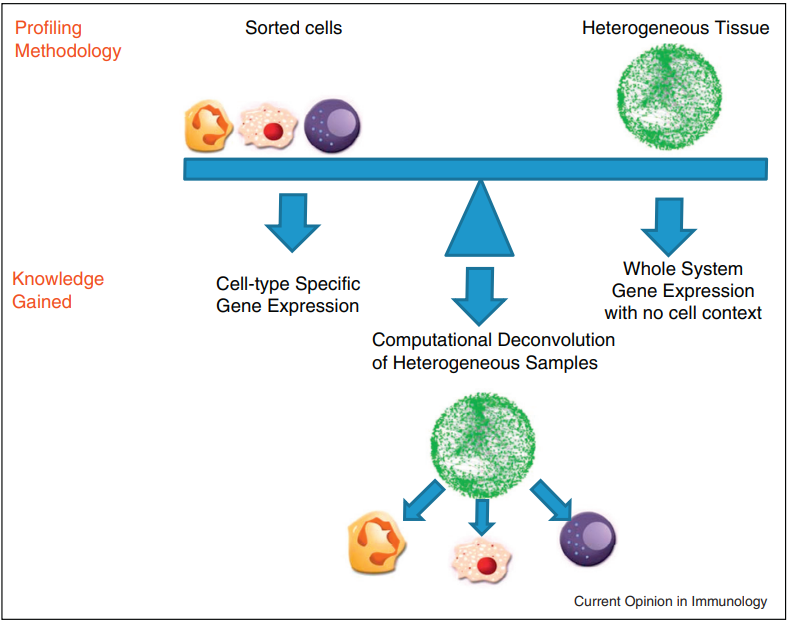
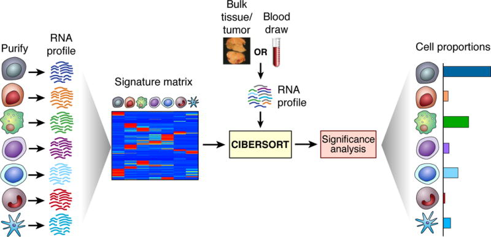
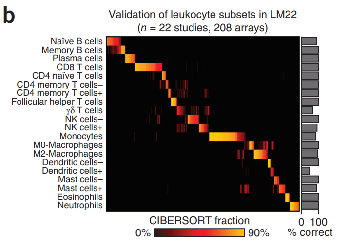
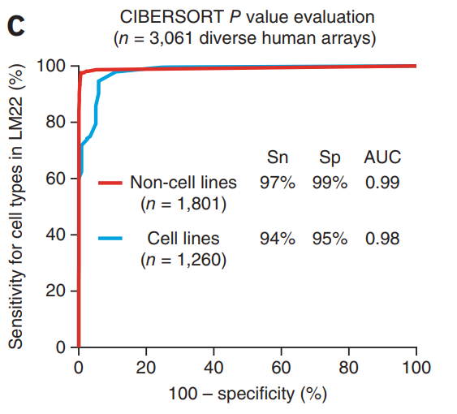
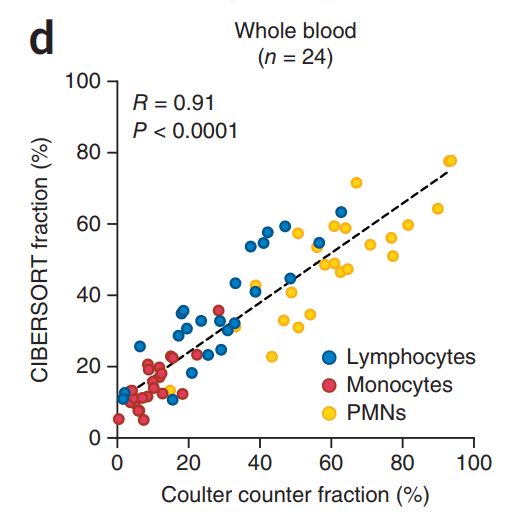
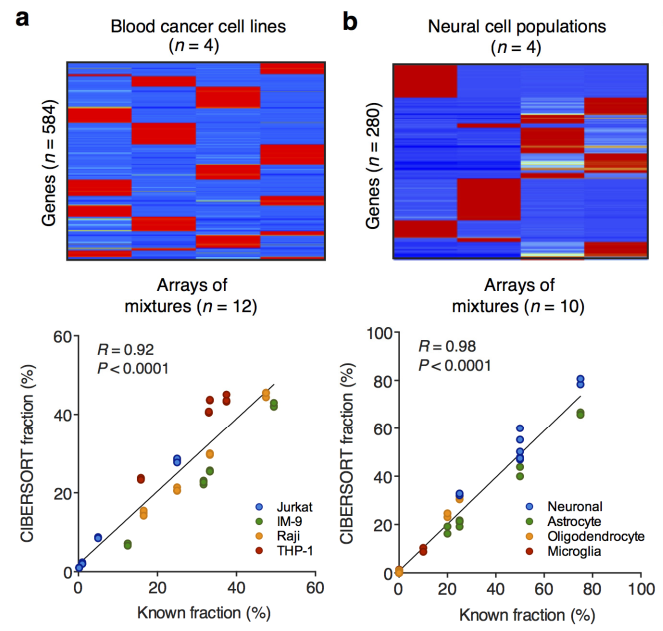
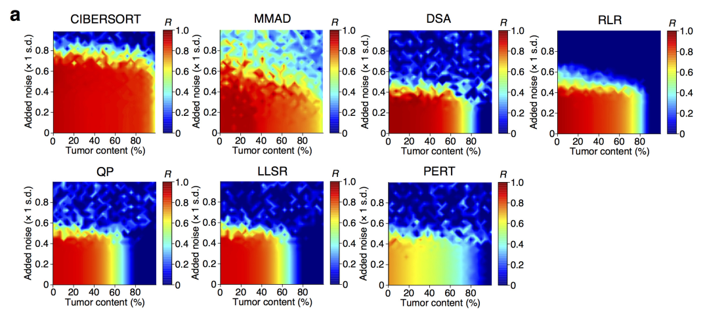
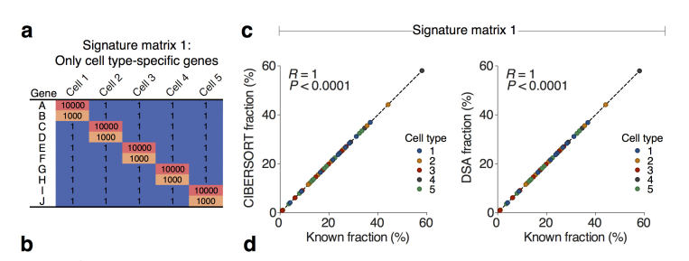
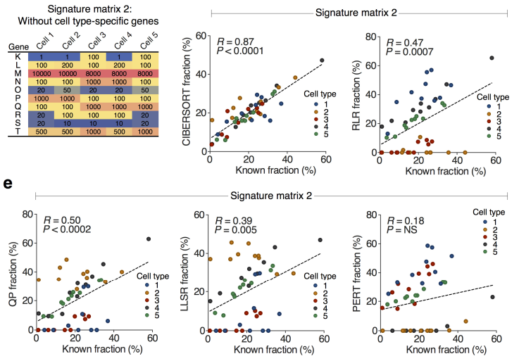
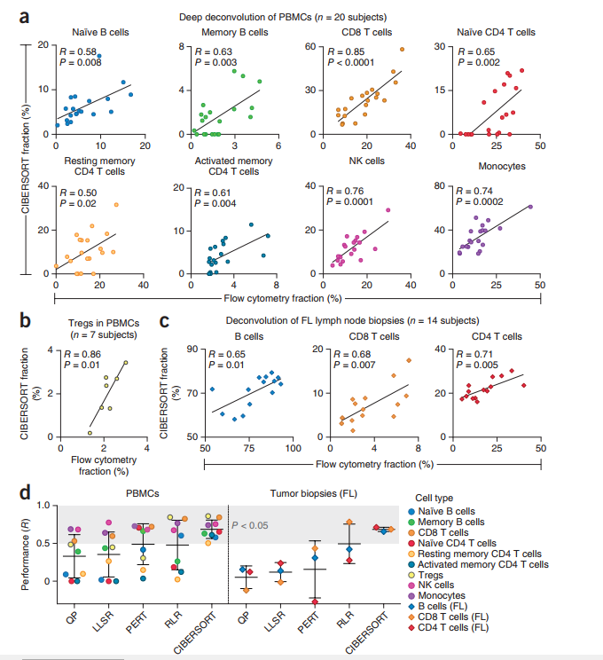

## CIBERSORT

**Robust enumeration of cell subsets from tissue expression profiles**
<br>Authors:<br>
Aaron M Newman, Chih Long Liu, Michael R Green, Andrew J Gentles, Weiguo Feng, Yue Xu, Chuong D Hoang, Maximilian Diehn & Ash A Alizadeh

**Journal Details:**
Journal : Nature Methods<br>
Impact factor: 30.822 (2019)<br>
ISO 4: Nat. Methods<br>
History: 2004–present<br>
Editor: Allison Doerr

**CENTRE**
1. Institute for Stem Cell Biology and Regenerative Medicine, Stanford University, Stanford, California, USA.
2. Department of Medicine, Division of Oncology, Stanford Cancer Institute, Stanford University, Stanford, California, USA. 
3. Center for Cancer Systems Biology, Stanford University, Stanford, California, USA.
4. Department of Radiology, Stanford University, Stanford, California, USA. 
5. Department of Radiation Oncology, Stanford University, Stanford, California, USA.
6. Department of Cardiothoracic Surgery, Division of Thoracic Surgery, Stanford University, Stanford, California, USA.
7. Stanford Cancer Institute, Stanford University, Stanford, California, USA.
8. Department of Medicine, Division of Hematology, Stanford Cancer Institute, Stanford University, Stanford, California, USA.
9Present address:
Correspondence should be addressed to A.A.A. (arasha@stanford.edu)

**What is the need for Immune subsets?**

The levels of infiltrating immune cells are associated with tumor growth, cancer progression and patient outcome

**Common Methods**

1. Immunohistochemistry
2. Flow cytometry <br><br>
-- But, they rely on a limited repertoire of **phenotypic markers** <br><br>
-- **Tissue disaggregation** before flow cytometry can lead to lost or damaged cells, altering results <br><br>
-- Fails to better discriminate **closely related cell populations**

**Computational Methods**

- Perform accurately on distinct cell subsets in mixtures with well-defined composition (for example, blood),
- But the are less effective for mixtures with unknown content and noise (for example, solid tumors) and for discriminating closely related cell types (for example, naïve vs. memory B cells)

 <br>
<br>

**Gap** <br>
Previous methods rely on phenotypic markers and fails to detect closely related cell populations


```python

```

**CIBERSORT METHODS**

Presents cell-type identification by estimating relative subsets of RNA transcripts<br>
Accurately resolves relative fractions of diverse cell subsets in GEPs from complex tissues

 <br>

**Cibersort Requirements**


The objective of most gene expression deconvolution algorithms is to solve the following system of linear equations for f:

`m = f × B` <br><br>
`m: a vector consisting of a mixture GEP (input requirement).`

`f: a vector consisting of the fraction of each cell type in the signature matrix (unknown).`

`B: a “signature matrix” containing signature genes for cell subsets of interest (input requirement).`

linear support vector regression  SVR performs a feature selection, in which genes from the signature matrix are adaptively selected to deconvolve a given mixture


1. input matrix of reference gene expression signatures, collectively used to estimate the relative proportions of each cell type of interest.

2. Leukocyte gene signature matrix

Leukocyte gene signature matrix contains 547 genes that distinguish 22 human hematopoietic cell phenotypes, including seven T-cell types, naïve and memory B cells, plasma cells, natural killer (NK) cells and myeloid subsets. [dataset here](https://www.ncbi.nlm.nih.gov/geo/query/acc.cgi?acc=GSE65136) Signature Matrix [LM22_details.xls]


**How is the signature Matrix Made?**

1. Derived from differential expression analysis of purified or enriched cell populations

2. Elimination of genes with uniform expression levels across the cell types of interest [House keeping genes, unexpressed genes]

3. Removed genes with higher noise level

### Validation of signature Matrix
Show supplementary files [SP2.xls]




### Sensitivity and Specificity of Cell types in CIBERSORT

1. LM22 to deconvolve 3,061 human transcriptomes [Show data: 'E-MTAB-62.sdrf.txt']
2. Marked the expression profiles as `Negative` and `Positive` based on the presenece of cell type in LM22 [Atleast one]
3. This was done for cell line and non-cell line separately.




**CIBERSORT achieved ≥94% sensitivity and ≥95% specificity for distinguishing positive from negative samples (pvalue <= 0.01)**


**Similar results were obtained using independently derived leukoyte signature matrix instead of LM22 (data not shown)** [Abbas et al., 2009](https://doi.org/10.1371%2Fjournal.pone.0006098)


### Testing CIBERSORT
1. Well defined mixtures
2. Bulk Tissues
3. Closely related cell types
4. Comparison with flow cytometry

### 1. Performance on well-defined mixtures

Comparison was made with other computational methods<br>

CIBERSORT, like other methods, achieved accurate results on idealized mixtures [Show Table SP4, sheet2]


<br>
**CIBERSORT analysis of 24 whole blood samples for lymphocytes, monocytes and neutrophils (PMNs) compared to measurements by Coulter counter**
<br><br>
<br>

(a) Top: purified blood cancer cell line expression profiles in GSE11103, (b) neural gene expression profiles in GSE19380

Bottom: Comparison of known and inferred fractions for defined mixtures of (a) blood cancer cell lines (GSE11103) and (b) neural cell types (GSE19380)


```python

```

### Bulk Tissues


To compare CIBERSORT’s technical performance with that of other methods on mixtures with unknown content, we employed commonly used benchmark data sets consisting of four admixed blood cancer cell lines




```python

```

### 3. Closely related cell types

CIBERSORT’s discriminatory ability on cell types with correlated GEPs, which can be difficult to resolve in mixtures owing to multicollinearity


Previous approaches avoid this issue by using cell type–specific marker genes or highly distinct GEPs.






```python

```

### 4. Comparison with flow cytometry





```python

```


```python

```


```python

```


```python

```


```python

```


```python

```


```python

```


```python

```


```python

```

[Computational deconvolution: extracting cell type-specific information from heterogeneous samples](https://doi.org/10.1016%2Fj.coi.2013.09.015) Shen-Orr & Gaujoux (2013)

[Deconvolution of blood microarray data identifies cellular activation patterns in systemic lupus erythematosus](https://doi.org/10.1371%2Fjournal.pone.0006098) Abbas et al.(2009)

[Optimal deconvolution of transcriptional profiling data using quadratic programming with application to complex clinical blood samples](https://doi.org/10.1371%2Fjournal.pone.0027156)   Gong, T. et al.(2011)

[PERT: a method for expression deconvolution of human blood samples from varied microenvironmental and developmental conditions.](https://doi.org/10.1371%2Fjournal.pcbi.1002838)  Qiao, W. et al.(2012)


[MMAD: microarray microdissection with analysis of differences is a computational tool for deconvoluting cell type-specific contributions from tissue samples](https://doi.org/10.1093%2Fbioinformatics%2Fbtt566) Liebner et al.(2014)

[Digital sorting of complex tissues for cell type-specific gene expression profiles](https://doi.org/10.1186%2F1471-2105-14-89) Zhong et al, 2013

[A self-directed method for cell-type identification and separation of gene expression microarrays]()


```python

```

`sensitivity` : is the ability of a test to correctly identify those with the disease (true positive rate), whereas test <br> `specificity` : is the ability of the test to correctly identify those without the disease (true negative rate)


```python

```
