## RPKM

`RPKM` (Reads Per Kilobase Million) or `FPKM` (Fragments Per Kilobase Million). However, `TPM` (Transcripts Per Kilobase Million) 

**These three metrics attempt to normalize for sequencing depth and gene length. <br> Here’s how you do it for RPKM:**

- Count up the total reads in a sample and divide that number by `1,000,000` – this is our "`per million`" scaling factor. <br><br>
- Divide the read counts by the "`per million`" scaling factor. This normalizes for sequencing depth, giving you reads per million (RPM) <br><br>
- Divide the RPM values by the length of the gene, in kilobases. This gives you RPKM.

**TPM is very similar to RPKM and FPKM. The only difference is the order of operations. <br> Here’s how you calculate TPM:**

- Divide the read counts by the length of each gene in kilobases. This gives you reads per kilobase (RPK). <br><br>
- Count up all the RPK values in a sample and divide this number by `1,000,000`. This is your “per million” scaling factor. <br><br>
- Divide the RPK values by the "`per million`" scaling factor. This gives you TPM.<br><br>

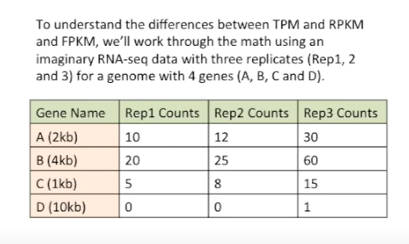

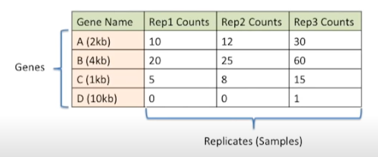

- replicate three has more reads compared to other replicates. This has higher sequencing depth compared to others <br><br>

- Gene B is double the size Gene A. <br><br>

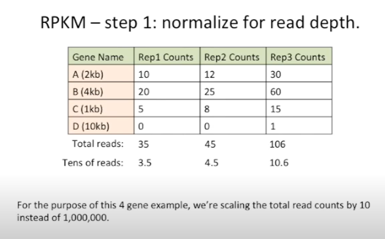

per million scaling factor for each replicate: `3.5`, `4.5`, `10.6`

Divide the each read counts by scaling factor and normalize for gene length
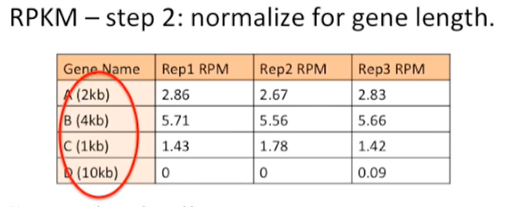

Divide by per kilobase
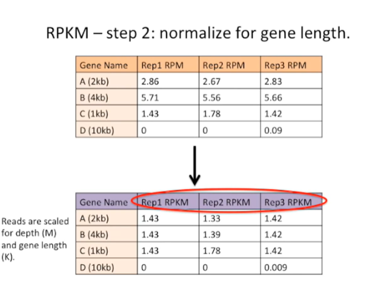

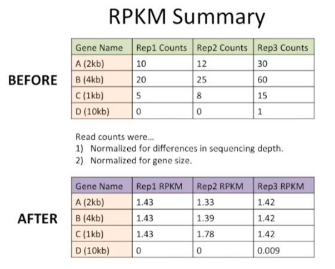


```python

```

### TPM

Divide by gene length
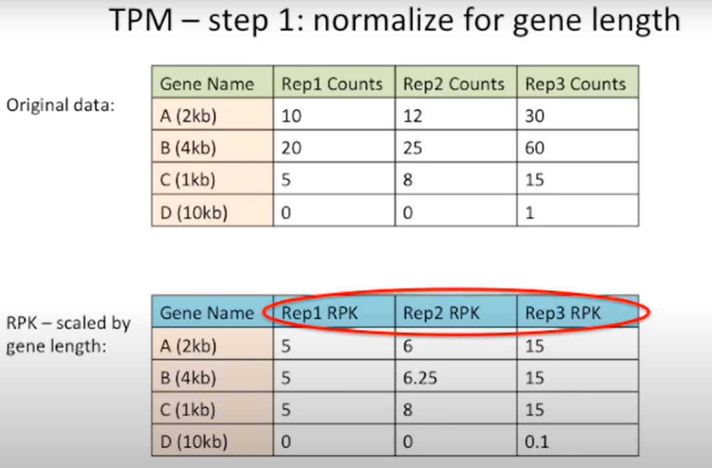


```python

```

Find scaling factor by adding and dividing by million factor<br>

Divide the read counts by scaling factor
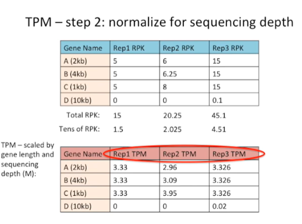


RPKM vs TPM

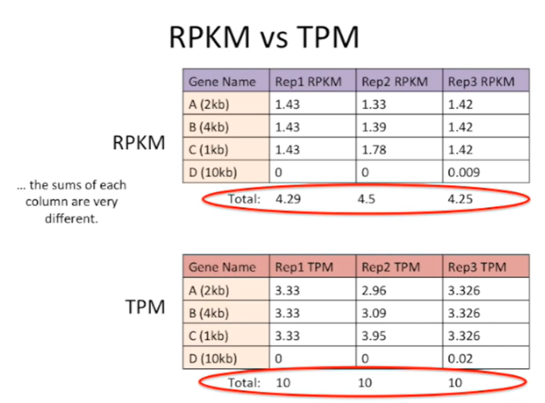


```python

```

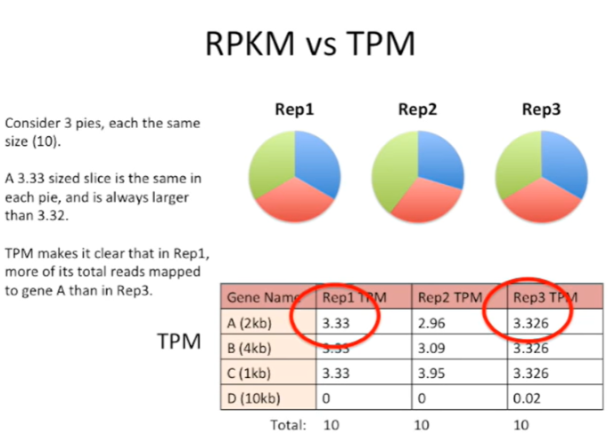


```python

```

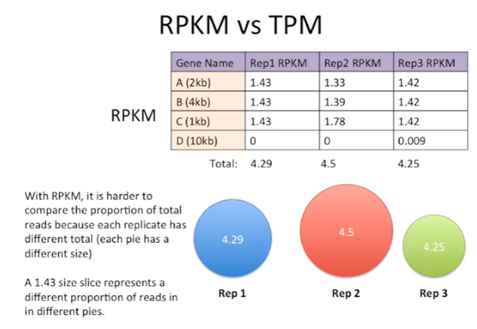

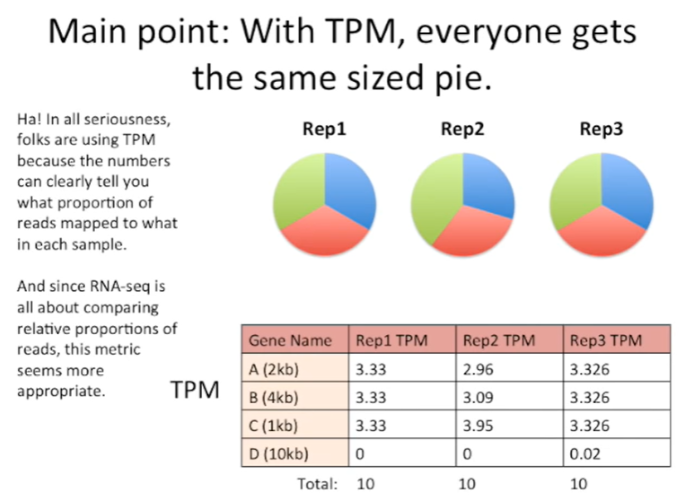


```python

```

## DESeq2


```python

```


```python

```


```python

```


```python

```


```python

```


```python

```


```python

```


```python

```
