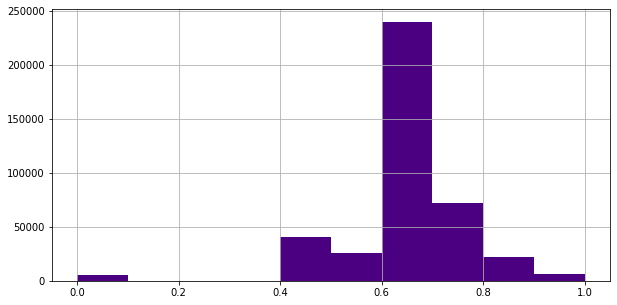

## A computational framework for the prioritization of genes

1. Ojective is to identify the differentially expressed genes that shares similar properties of the **(BASE GENES)** in terms of function or co-regulation

#### Reference

1. [A computational framework for the prioritization of disease-gene candidates](https://bmcgenomics.biomedcentral.com/articles/10.1186/1471-2164-16-S9-S2) <br>

2. [Identification of key regulatory genes connected to NF-κB family of proteins in visceral adipose tissues using gene expression and weighted protein interaction network](http://www.ncbi.nlm.nih.gov/pmc/articles/pmc6478283/) <br>

3. [Construction and analysis of the protein-protein interaction networks based on gene expression profiles of Parkinson’s disease](https://doi.org/10.1371/journal.pone.0103047) <br>

### 1. Selection of the base Genes
The curated genes from various studies related to the disease or condition of interest **(BASE GENES)**.

### 2. Collection of Gene Expression Data
The microarray gene expression profile of disease of interest was taken from the GEO database (www.ncbi.nlm.nih.gov/geo)

### 3. Data Normalization and Analysis
1. Analysis of microarray gene expression data was carried out by using R/Bioconductor. <br>
2. Normalization of the microarray dataset was performed using Quantile or Robust Multiarray Average (RMA) algorithm <br>
3. Statistically significant genes between control and treated samples were computed by applying t-statistic.<br>

### 4. Protein-Protein Interaction Map
An experimentally validated protein–protein interaction map **(PPIM)** was constructed using data deposited in the Biomolecular Interaction Network Database (**BIND**), Biological General Repository for Interaction Datasets (**BioGRID**), The Molecular Interaction Database (**MINT**), Database of Interacting Proteins (**DIP**), Human Protein Reference Database (**HPRD**), and **IntAct** database. <br><br>In the current analysis we used data from [HIPPIE database](http://cbdm-01.zdv.uni-mainz.de/~mschaefer/hippie/) was used. [Gregorio et al., 2017](https://doi.org/10.1093/nar/gkw985); [Martin et al., 2012](https://dx.doi.org/10.1371%2Fjournal.pone.0031826).<br> All the significant gene's (p<=0.05) + base genes from our analysis was overlapped with HIPPIE database to derive the PPIM

### 5. Toplogical parameters (Using Cytoscape)
Apply topological parameters (Degree, betweenness) based on Graph theory to subset the genes as hubs and bottlenecks. Degree represnts the connectivity of a gene in the network.<br>
Mean Degree across the genes were calculated = M <br>
Standrd deviation of the degree across genes were calculated = SD <br>

**Hubs = M + (2 x SD)** [Fiona et al 2015](https://bmcgenomics.biomedcentral.com/articles/10.1186/1471-2164-16-S9-S2)<br>

### 6. Construction of Sub-Network
The subnetwork (**SPIN**) was created by extracting "Hubs", **BASE GENES** and their connected partners from the PPIM.

### 7. Identification of pairwise gene correlation
Pearson’s correlation algorithm was applied to the genes of 'Sub-Network' to create a weighted gene correlation map based on Pearson's Correlation Coefficient (PCC).In this approach, PCC between the gene-gene pairs in **SPIN** was generated for both control and treated group separately. Next, the difference of PCC (DPCC) between gene pairs of disease and control group. Higher DPCC score implies distinct variation in gene’s interaction from control to treated condition


### 8. Semantic Similarity Between Gene Pairs
It has been observed that genes involved in phenotypically similar diseases are often functionally related on the molecular level [Schlicker et al., 2010](https://dx.doi.org/10.1093%2Fbioinformatics%2Fbtq384)<br><br>
Functional resemblance among two genes is evaluated using prearranged data available in Gene Ontology.<br><br> To evaluate the functional similarity between two genes, Wang’s measure of semantic similarity was applied to molecular function (MF) hierarchy as MF, which specifically defines a particular gene in terms of functional ontology.<br><br> Since a gene can be annotated by many GO terms, we used Best-Match Average (BMA) method which combine semantic similarity scores of several GO terms and calculates the average of all maximum similarities on each row and column
<br><br>The semantic score of functional similarity between genes range from 0 to 1. Higher semantic score between genes represents a stronger functional relationship among the genes

### 9. Extracting the gene pairs with Fold Change
Consider the interactions, fold change in bracket, <br><br>
"IL6 (1.5)  =::=  TNF (0.5)" <br>
"IL6 (1.5)  =::=  VEGFA (2.5)" <br>
"ATM (0.3)  =::=  TNF (0.5)" <br>
"ATM (0.3)  =::=  IL6 (1.5)" <br>
"ATM (0.3)  =::=  SPP1 (0.2)" <br>

If one of the gene in the interaction falls under the cut-off of FoldChnage threshold (viz. 1.5) those pair of genes are considered. After applying the cutoff the following gene pairs are obtained.<br>

"IL6 (1.5) :: TNF (0.5)" <br>
"IL6 (1.5) :: VEGFA (2.5)" <br>
"ATM (0.3) :: IL6 (1.5)" <br>
<br>
This was done to include the genes that shares similar function with a deregulated genes for functional enrichment analysis
### 10. Isolated genes with high differential expression
There may be some genes which are highly differentially expressed but get removed due to lack of connectivity (isolated node) or some other parameters in the filter. <br> To retain these genes in the list, **absolute fold change** with specific threshold was screened from the initial list of significant genes from **step 3**.
Next, genes which falls under top 75 quantile were screened and included in the final list. There can be many overlap with the genes screened at **step 9**

### 11. Functional annotation
Functional annotation is performed to gain insights into the high-throughput biological data. This method not only authenticates the new genes found in biological experiment as functionally significant but also uncovers the biological interactions among them.


```python

```


```python
import pandas as pd
import matplotlib.pyplot as plt
import matplotlib.mlab as mlab
from bioinfokit import analys, visuz
```
    

#### Base Genes
There were total 314 base genes from different class as AR, ER and PR


```python
base_genes = pd.read_table(r"F:\snijesh\OneDrive - St John's National Academy of Health Sciences\Re_analysis\SNJ_WorkingDirectory\GSE61368\base_genes.txt")
base_genes
```


<div>
<table border="1" class="dataframe">
  <thead>
    <tr style="text-align: right;">
      <th></th>
      <th>GeneID</th>
      <th>Class</th>
      <th>EntrezID</th>
      <th>GeneName</th>
      <th>MappedID</th>
      <th>MapScore</th>
      <th>IS_BASE</th>
    </tr>
  </thead>
  <tbody>
    <tr>
      <td>0</td>
      <td>DOCK10</td>
      <td>AR</td>
      <td>55619</td>
      <td>DOCK10 (dedicator of cytokinesis 10)</td>
      <td>DOCK10</td>
      <td>1</td>
      <td>1</td>
    </tr>
    <tr>
      <td>1</td>
      <td>SCIN</td>
      <td>AR</td>
      <td>85477</td>
      <td>SCIN (scinderin)</td>
      <td>SCIN</td>
      <td>1</td>
      <td>1</td>
    </tr>
    <tr>
      <td>2</td>
      <td>CBLN2</td>
      <td>AR</td>
      <td>147381</td>
      <td>CBLN2 (cerebellin 2 precursor)</td>
      <td>CBLN2</td>
      <td>1</td>
      <td>1</td>
    </tr>
    <tr>
      <td>3</td>
      <td>CD9</td>
      <td>AR</td>
      <td>928</td>
      <td>CD9 (CD9 molecule)</td>
      <td>CD9</td>
      <td>1</td>
      <td>1</td>
    </tr>
    <tr>
      <td>4</td>
      <td>PIP</td>
      <td>AR</td>
      <td>5304</td>
      <td>PIP (prolactin induced protein)</td>
      <td>PIP</td>
      <td>1</td>
      <td>1</td>
    </tr>
    <tr>
      <td>...</td>
      <td>...</td>
      <td>...</td>
      <td>...</td>
      <td>...</td>
      <td>...</td>
      <td>...</td>
      <td>...</td>
    </tr>
    <tr>
      <td>309</td>
      <td>DKFZP564K0822</td>
      <td>ER</td>
      <td>81552</td>
      <td>VOPP1 (VOPP1 WW domain binding protein)</td>
      <td>VOPP1</td>
      <td>0</td>
      <td>1</td>
    </tr>
    <tr>
      <td>310</td>
      <td>FLJ20151</td>
      <td>ER</td>
      <td>771</td>
      <td>CA12 (carbonic anhydrase 12)</td>
      <td>CA12</td>
      <td>0</td>
      <td>1</td>
    </tr>
    <tr>
      <td>311</td>
      <td>KIAA1025</td>
      <td>ER</td>
      <td>23389</td>
      <td>MED13L (mediator complex subunit 13L)</td>
      <td>MED13L</td>
      <td>0</td>
      <td>1</td>
    </tr>
    <tr>
      <td>312</td>
      <td>FLJ23186</td>
      <td>ER</td>
      <td>79669</td>
      <td>C3orf52 (chromosome 3 open reading frame 52)</td>
      <td>C3orf52</td>
      <td>0</td>
      <td>1</td>
    </tr>
    <tr>
      <td>313</td>
      <td>MGC4171</td>
      <td>ER</td>
      <td>79153</td>
      <td>GDPD3 (glycerophosphodiester phosphodiesteras...</td>
      <td>GDPD3</td>
      <td>0</td>
      <td>1</td>
    </tr>
  </tbody>
</table>
<p>314 rows × 7 columns</p>
</div>


#### Data set information

Cells were cotreated with **dihydrotestosterone**, **progesterone** or medroxyprogesterone acetate and **estrdiol** to assess the combinatorial effects of hormone exposure in breast cancer cells<br>

GSE ID : [GSE61368](https://www.ncbi.nlm.nih.gov/geo/query/acc.cgi?acc=GSE61368)


```python
sample_info = pd.read_table(r"F:\snijesh\OneDrive - St John's National Academy of Health Sciences\Re_analysis\SNJ_WorkingDirectory\GSE61368\sample_info_dht_er.txt")
sample_info
```


<div>
<table border="1" class="dataframe">
  <thead>
    <tr style="text-align: right;">
      <th></th>
      <th>SAMPLE_ID</th>
      <th>SAMPLE_NAME</th>
    </tr>
  </thead>
  <tbody>
    <tr>
      <td>0</td>
      <td>GSM1503194</td>
      <td>ZR751_VC_rep4</td>
    </tr>
    <tr>
      <td>1</td>
      <td>GSM1503207</td>
      <td>ZR751_VC_rep3</td>
    </tr>
    <tr>
      <td>2</td>
      <td>GSM1503181</td>
      <td>ZR751_VC_rep2</td>
    </tr>
    <tr>
      <td>3</td>
      <td>GSM1503183</td>
      <td>ZR751_VC_rep1</td>
    </tr>
    <tr>
      <td>4</td>
      <td>GSM1503209</td>
      <td>ZR751_E2s_rep4</td>
    </tr>
    <tr>
      <td>5</td>
      <td>GSM1503197</td>
      <td>ZR751_E2s_rep3</td>
    </tr>
    <tr>
      <td>6</td>
      <td>GSM1503191</td>
      <td>ZR751_E2s_rep2</td>
    </tr>
    <tr>
      <td>7</td>
      <td>GSM1503190</td>
      <td>ZR751_E2s_rep1</td>
    </tr>
    <tr>
      <td>8</td>
      <td>GSM1503179</td>
      <td>ZR751_E2s_DHT_rep4</td>
    </tr>
    <tr>
      <td>9</td>
      <td>GSM1503188</td>
      <td>ZR751_E2s_DHT_rep3</td>
    </tr>
    <tr>
      <td>10</td>
      <td>GSM1503189</td>
      <td>ZR751_E2s_DHT_rep2</td>
    </tr>
    <tr>
      <td>11</td>
      <td>GSM1503193</td>
      <td>ZR751_E2s_DHT_rep1</td>
    </tr>
    <tr>
      <td>12</td>
      <td>GSM1503192</td>
      <td>ZR751_DHT_rep4</td>
    </tr>
    <tr>
      <td>13</td>
      <td>GSM1503210</td>
      <td>ZR751_DHT_rep3</td>
    </tr>
    <tr>
      <td>14</td>
      <td>GSM1503200</td>
      <td>ZR751_DHT_rep2</td>
    </tr>
    <tr>
      <td>15</td>
      <td>GSM1503199</td>
      <td>ZR751_DHT_rep1</td>
    </tr>
  </tbody>
</table>
</div>


#### Gene Expression Profile
In the initial stage of analysis we considered the **DHT** treatment in **C**. Data are normalized using Quantile Normalization


```python
dht_data = pd.read_table(r"F:\snijesh\OneDrive - St John's National Academy of Health Sciences\Re_analysis\SNJ_WorkingDirectory\GSE61368\dht_filtered\all_dht.txt", sep='\t')
dht_data
```


<div>

<table border="1" class="dataframe">
  <thead>
    <tr style="text-align: right;">
      <th></th>
      <th>Entrez_Gene_ID</th>
      <th>Symbol</th>
      <th>Coef.DHTx</th>
      <th>p.value.DHTx</th>
      <th>BASE_GENES</th>
      <th>FC</th>
    </tr>
  </thead>
  <tbody>
    <tr>
      <td>0</td>
      <td>1794</td>
      <td>DOCK2</td>
      <td>-2.291497</td>
      <td>6.260000e-10</td>
      <td>0</td>
      <td>-4.895640</td>
    </tr>
    <tr>
      <td>1</td>
      <td>147381</td>
      <td>CBLN2</td>
      <td>-1.453471</td>
      <td>1.440000e-06</td>
      <td>1</td>
      <td>-2.738662</td>
    </tr>
    <tr>
      <td>2</td>
      <td>25928</td>
      <td>SOSTDC1</td>
      <td>-0.912464</td>
      <td>3.090000e-05</td>
      <td>0</td>
      <td>-1.882258</td>
    </tr>
    <tr>
      <td>3</td>
      <td>91523</td>
      <td>FAM113B</td>
      <td>-0.871406</td>
      <td>6.810000e-05</td>
      <td>0</td>
      <td>-1.829445</td>
    </tr>
    <tr>
      <td>4</td>
      <td>8555</td>
      <td>CDC14B</td>
      <td>-0.846160</td>
      <td>2.120692e-02</td>
      <td>0</td>
      <td>-1.797710</td>
    </tr>
    <tr>
      <td>...</td>
      <td>...</td>
      <td>...</td>
      <td>...</td>
      <td>...</td>
      <td>...</td>
      <td>...</td>
    </tr>
    <tr>
      <td>25181</td>
      <td>7365</td>
      <td>UGT2B10</td>
      <td>2.156155</td>
      <td>5.740000e-14</td>
      <td>0</td>
      <td>4.457254</td>
    </tr>
    <tr>
      <td>25182</td>
      <td>9073</td>
      <td>CLDN8</td>
      <td>2.296008</td>
      <td>2.760000e-10</td>
      <td>0</td>
      <td>4.910970</td>
    </tr>
    <tr>
      <td>25183</td>
      <td>54490</td>
      <td>UGT2B28</td>
      <td>4.020398</td>
      <td>5.720000e-18</td>
      <td>0</td>
      <td>16.227830</td>
    </tr>
    <tr>
      <td>25184</td>
      <td>7364</td>
      <td>UGT2B7</td>
      <td>4.351573</td>
      <td>1.020000e-18</td>
      <td>0</td>
      <td>20.415222</td>
    </tr>
    <tr>
      <td>25185</td>
      <td>10720</td>
      <td>UGT2B11</td>
      <td>4.502725</td>
      <td>5.460000e-20</td>
      <td>0</td>
      <td>22.670194</td>
    </tr>
  </tbody>
</table>
<p>25186 rows × 6 columns</p>
</div>


```python
#statistically signicant genes with a pvalue 0.05
dht_data[dht_data['p.value.DHTx'] <= 0.05] #There were 2618 significant genes by p-value cut-off <= 0.05
```

<div>
<table border="1" class="dataframe">
  <thead>
    <tr style="text-align: right;">
      <th></th>
      <th>Entrez_Gene_ID</th>
      <th>Symbol</th>
      <th>Coef.DHTx</th>
      <th>p.value.DHTx</th>
      <th>BASE_GENES</th>
      <th>FC</th>
    </tr>
  </thead>
  <tbody>
    <tr>
      <td>0</td>
      <td>1794</td>
      <td>DOCK2</td>
      <td>-2.291497</td>
      <td>6.260000e-10</td>
      <td>0</td>
      <td>-4.895640</td>
    </tr>
    <tr>
      <td>1</td>
      <td>147381</td>
      <td>CBLN2</td>
      <td>-1.453471</td>
      <td>1.440000e-06</td>
      <td>1</td>
      <td>-2.738662</td>
    </tr>
    <tr>
      <td>2</td>
      <td>25928</td>
      <td>SOSTDC1</td>
      <td>-0.912464</td>
      <td>3.090000e-05</td>
      <td>0</td>
      <td>-1.882258</td>
    </tr>
    <tr>
      <td>3</td>
      <td>91523</td>
      <td>FAM113B</td>
      <td>-0.871406</td>
      <td>6.810000e-05</td>
      <td>0</td>
      <td>-1.829445</td>
    </tr>
    <tr>
      <td>4</td>
      <td>8555</td>
      <td>CDC14B</td>
      <td>-0.846160</td>
      <td>2.120692e-02</td>
      <td>0</td>
      <td>-1.797710</td>
    </tr>
    <tr>
      <td>...</td>
      <td>...</td>
      <td>...</td>
      <td>...</td>
      <td>...</td>
      <td>...</td>
      <td>...</td>
    </tr>
    <tr>
      <td>25181</td>
      <td>7365</td>
      <td>UGT2B10</td>
      <td>2.156155</td>
      <td>5.740000e-14</td>
      <td>0</td>
      <td>4.457254</td>
    </tr>
    <tr>
      <td>25182</td>
      <td>9073</td>
      <td>CLDN8</td>
      <td>2.296008</td>
      <td>2.760000e-10</td>
      <td>0</td>
      <td>4.910970</td>
    </tr>
    <tr>
      <td>25183</td>
      <td>54490</td>
      <td>UGT2B28</td>
      <td>4.020398</td>
      <td>5.720000e-18</td>
      <td>0</td>
      <td>16.227830</td>
    </tr>
    <tr>
      <td>25184</td>
      <td>7364</td>
      <td>UGT2B7</td>
      <td>4.351573</td>
      <td>1.020000e-18</td>
      <td>0</td>
      <td>20.415222</td>
    </tr>
    <tr>
      <td>25185</td>
      <td>10720</td>
      <td>UGT2B11</td>
      <td>4.502725</td>
      <td>5.460000e-20</td>
      <td>0</td>
      <td>22.670194</td>
    </tr>
  </tbody>
</table>
<p>2618 rows × 6 columns</p>
</div>


```python
#keeping only significant pvalue of 0.05
genenames = ('DOCK2', 'CBLN2', 'SOSTDC1', 'FAM113B', 'CDC14B', 'UGT2B10', 'CLDN8', 'UGT2B28', 'UGT2B7', 'UGT2B11', 'CLEC3A')
visuz.gene_exp.volcano(df=dht_data, lfc='Coef.DHTx', pv='p.value.DHTx',
                       lfc_thr=0, pv_thr=0.05,
                       color=("#00239CFF", "grey", "#E10600FF"), geneid="Symbol", genenames=genenames,
                       plotlegend=True, legendpos='upper right', show=True,
                       legendanchor=(1.46,1))
```


```python
#Selecting the significant genes and base genes (regardless of any other parameters)
selected=dht_data[(dht_data['p.value.DHTx'] <= 0.05) | (dht_data['BASE_GENES'] ==1)]
selected
```


<div>

<table border="1" class="dataframe">
  <thead>
    <tr style="text-align: right;">
      <th></th>
      <th>Entrez_Gene_ID</th>
      <th>Symbol</th>
      <th>Coef.DHTx</th>
      <th>p.value.DHTx</th>
      <th>BASE_GENES</th>
      <th>FC</th>
    </tr>
  </thead>
  <tbody>
    <tr>
      <td>0</td>
      <td>1794</td>
      <td>DOCK2</td>
      <td>-2.291497</td>
      <td>6.260000e-10</td>
      <td>0</td>
      <td>-4.895640</td>
    </tr>
    <tr>
      <td>1</td>
      <td>147381</td>
      <td>CBLN2</td>
      <td>-1.453471</td>
      <td>1.440000e-06</td>
      <td>1</td>
      <td>-2.738662</td>
    </tr>
    <tr>
      <td>2</td>
      <td>25928</td>
      <td>SOSTDC1</td>
      <td>-0.912464</td>
      <td>3.090000e-05</td>
      <td>0</td>
      <td>-1.882258</td>
    </tr>
    <tr>
      <td>3</td>
      <td>91523</td>
      <td>FAM113B</td>
      <td>-0.871406</td>
      <td>6.810000e-05</td>
      <td>0</td>
      <td>-1.829445</td>
    </tr>
    <tr>
      <td>4</td>
      <td>8555</td>
      <td>CDC14B</td>
      <td>-0.846160</td>
      <td>2.120692e-02</td>
      <td>0</td>
      <td>-1.797710</td>
    </tr>
    <tr>
      <td>...</td>
      <td>...</td>
      <td>...</td>
      <td>...</td>
      <td>...</td>
      <td>...</td>
      <td>...</td>
    </tr>
    <tr>
      <td>25181</td>
      <td>7365</td>
      <td>UGT2B10</td>
      <td>2.156155</td>
      <td>5.740000e-14</td>
      <td>0</td>
      <td>4.457254</td>
    </tr>
    <tr>
      <td>25182</td>
      <td>9073</td>
      <td>CLDN8</td>
      <td>2.296008</td>
      <td>2.760000e-10</td>
      <td>0</td>
      <td>4.910970</td>
    </tr>
    <tr>
      <td>25183</td>
      <td>54490</td>
      <td>UGT2B28</td>
      <td>4.020398</td>
      <td>5.720000e-18</td>
      <td>0</td>
      <td>16.227830</td>
    </tr>
    <tr>
      <td>25184</td>
      <td>7364</td>
      <td>UGT2B7</td>
      <td>4.351573</td>
      <td>1.020000e-18</td>
      <td>0</td>
      <td>20.415222</td>
    </tr>
    <tr>
      <td>25185</td>
      <td>10720</td>
      <td>UGT2B11</td>
      <td>4.502725</td>
      <td>5.460000e-20</td>
      <td>0</td>
      <td>22.670194</td>
    </tr>
  </tbody>
</table>
<p>2853 rows × 6 columns</p>
</div>


#### Protein Interaction network


```python
#Whole interactome protein protein interaction map
ppi = pd.read_table(r"F:\snijesh\OneDrive - St John's National Academy of Health Sciences\Re_analysis\Hippie\hippie_current.txt", sep="\t")
ppi #There are about 411430 protein-protein interactions

ppi4 = ppi[ppi['Score']>=0.4]
ppi4 #There are about 405704 protein-protein interactions with score 0.4 and above
```


<div>

<table border="1" class="dataframe">
  <thead>
    <tr style="text-align: right;">
      <th></th>
      <th>Gene1</th>
      <th>EntrezID1</th>
      <th>Gene2</th>
      <th>EntrezID2</th>
      <th>Score</th>
      <th>Reference</th>
    </tr>
  </thead>
  <tbody>
    <tr>
      <td>0</td>
      <td>AL1A1_HUMAN</td>
      <td>216</td>
      <td>AL1A1_HUMAN</td>
      <td>216</td>
      <td>0.76</td>
      <td>experiments:in vivo,Two-hybrid;pmids:12081471,...</td>
    </tr>
    <tr>
      <td>1</td>
      <td>ITA7_HUMAN</td>
      <td>3679</td>
      <td>ACHA_HUMAN</td>
      <td>1134</td>
      <td>0.73</td>
      <td>experiments:in vivo,Affinity Capture-Western,a...</td>
    </tr>
    <tr>
      <td>2</td>
      <td>NEB1_HUMAN</td>
      <td>55607</td>
      <td>ACTG_HUMAN</td>
      <td>71</td>
      <td>0.65</td>
      <td>experiments:in vitro,in vivo;pmids:9362513,120...</td>
    </tr>
    <tr>
      <td>3</td>
      <td>SRGN_HUMAN</td>
      <td>5552</td>
      <td>CD44_HUMAN</td>
      <td>960</td>
      <td>0.63</td>
      <td>experiments:in vivo;pmids:9334256,16189514,167...</td>
    </tr>
    <tr>
      <td>4</td>
      <td>GRB7_HUMAN</td>
      <td>2886</td>
      <td>ERBB2_HUMAN</td>
      <td>2064</td>
      <td>0.90</td>
      <td>experiments:in vitro,in vivo,Reconstituted Com...</td>
    </tr>
    <tr>
      <td>...</td>
      <td>...</td>
      <td>...</td>
      <td>...</td>
      <td>...</td>
      <td>...</td>
      <td>...</td>
    </tr>
    <tr>
      <td>411425</td>
      <td>CH60_HUMAN</td>
      <td>3329</td>
      <td>RM41_HUMAN</td>
      <td>64975</td>
      <td>0.49</td>
      <td>pmids:29568061;sources:IntAct</td>
    </tr>
    <tr>
      <td>411426</td>
      <td>CS010_HUMAN</td>
      <td>56005</td>
      <td>MTL5_HUMAN</td>
      <td>9633</td>
      <td>0.63</td>
      <td>experiments:cross-linking study;pmids:30021884...</td>
    </tr>
    <tr>
      <td>411427</td>
      <td>KI67_HUMAN</td>
      <td>4288</td>
      <td>C1TM_HUMAN</td>
      <td>25902</td>
      <td>0.63</td>
      <td>experiments:anti tag coimmunoprecipitation;pmi...</td>
    </tr>
    <tr>
      <td>411428</td>
      <td>DUX4_HUMAN</td>
      <td>22947</td>
      <td>TBB2A_HUMAN</td>
      <td>7280</td>
      <td>0.56</td>
      <td>experiments:pull down;pmids:26816005;sources:I...</td>
    </tr>
    <tr>
      <td>411429</td>
      <td>DICER_HUMAN</td>
      <td>23405</td>
      <td>ADT2_HUMAN</td>
      <td>292</td>
      <td>0.63</td>
      <td>experiments:anti tag coimmunoprecipitation;pmi...</td>
    </tr>
  </tbody>
</table>
<p>405704 rows × 6 columns</p>
</div>


```python
# Histogram: Distribution of interaction data with corresponding scores
#plt.hist(ppi['Score'], 10, range=[0, 1], facecolor='indigo', align='mid')
ppi['Score'].hist(bins=10, figsize=[10,5], facecolor='indigo')
#more data lies with score 0.4 and above hence considerd interaction that has an edge weight >= 0.4
```


    <AxesSubplot:>





```python
#Extracting all interactions of selected data
df = ppi4[ppi4['EntrezID1'].isin(selected['Entrez_Gene_ID']) | ppi4['EntrezID2'].isin(selected['Entrez_Gene_ID'])]
df.to_csv("DHT_ppi.txt", sep="\t", index=False)
df
```


<div>

<table border="1" class="dataframe">
  <thead>
    <tr style="text-align: right;">
      <th></th>
      <th>Gene1</th>
      <th>EntrezID1</th>
      <th>Gene2</th>
      <th>EntrezID2</th>
      <th>Score</th>
      <th>Reference</th>
    </tr>
  </thead>
  <tbody>
    <tr>
      <td>4</td>
      <td>GRB7_HUMAN</td>
      <td>2886</td>
      <td>ERBB2_HUMAN</td>
      <td>2064</td>
      <td>0.90</td>
      <td>experiments:in vitro,in vivo,Reconstituted Com...</td>
    </tr>
    <tr>
      <td>5</td>
      <td>PAK1_HUMAN</td>
      <td>5058</td>
      <td>ERBB2_HUMAN</td>
      <td>2064</td>
      <td>0.73</td>
      <td>experiments:in vivo,Affinity Capture-Western,a...</td>
    </tr>
    <tr>
      <td>6</td>
      <td>DLG4_HUMAN</td>
      <td>1742</td>
      <td>ERBB2_HUMAN</td>
      <td>2064</td>
      <td>0.87</td>
      <td>experiments:in vivo,Two-hybrid,Affinity Captur...</td>
    </tr>
    <tr>
      <td>7</td>
      <td>P85B_HUMAN</td>
      <td>5296</td>
      <td>ERBB2_HUMAN</td>
      <td>2064</td>
      <td>0.89</td>
      <td>experiments:in vivo,Reconstituted Complex,Bioc...</td>
    </tr>
    <tr>
      <td>8</td>
      <td>PTN18_HUMAN</td>
      <td>26469</td>
      <td>ERBB2_HUMAN</td>
      <td>2064</td>
      <td>0.88</td>
      <td>experiments:in vitro,pull down,anti tag coimmu...</td>
    </tr>
    <tr>
      <td>...</td>
      <td>...</td>
      <td>...</td>
      <td>...</td>
      <td>...</td>
      <td>...</td>
      <td>...</td>
    </tr>
    <tr>
      <td>411409</td>
      <td>CKAP4_HUMAN</td>
      <td>10970</td>
      <td>TAF1_HUMAN</td>
      <td>6872</td>
      <td>0.63</td>
      <td>experiments:cross-linking study;pmids:30021884...</td>
    </tr>
    <tr>
      <td>411412</td>
      <td>MD2L2_HUMAN</td>
      <td>10459</td>
      <td>DTWD1_HUMAN</td>
      <td>56986</td>
      <td>0.63</td>
      <td>experiments:anti tag coimmunoprecipitation;pmi...</td>
    </tr>
    <tr>
      <td>411413</td>
      <td>BCAR1_HUMAN</td>
      <td>9564</td>
      <td>DHE3_HUMAN</td>
      <td>2746</td>
      <td>0.63</td>
      <td>experiments:anti bait coimmunoprecipitation;pm...</td>
    </tr>
    <tr>
      <td>411420</td>
      <td>MGST3_HUMAN</td>
      <td>4259</td>
      <td>CLPX_HUMAN</td>
      <td>10845</td>
      <td>0.49</td>
      <td>pmids:29568061;sources:IntAct</td>
    </tr>
    <tr>
      <td>411429</td>
      <td>DICER_HUMAN</td>
      <td>23405</td>
      <td>ADT2_HUMAN</td>
      <td>292</td>
      <td>0.63</td>
      <td>experiments:anti tag coimmunoprecipitation;pmi...</td>
    </tr>
  </tbody>
</table>
<p>112282 rows × 6 columns</p>
</div>


**The PPI developed was imported to cytoscape to compute the topological parameters.
Next,  PPI was decomposed to a subnetwork using** ```"hubs+partners" & "base genes+partners"```


```python
##subnetwork gene pairs (edges)
edge_map = pd.read_table(r"F:\snijesh\OneDrive - St John's National Academy of Health Sciences\Re_analysis\SNJ_WorkingDirectory\GSE61368\dht_filtered\edge_map.txt", sep='\t')
edge_map
```


<div>
<table border="1" class="dataframe">
  <thead>
    <tr style="text-align: right;">
      <th></th>
      <th>Gene-1</th>
      <th>Gene-2</th>
      <th>Score</th>
      <th>Gene1FC</th>
      <th>Gene2FC</th>
    </tr>
  </thead>
  <tbody>
    <tr>
      <td>0</td>
      <td>7163</td>
      <td>2026</td>
      <td>0.49</td>
      <td>1.416390</td>
      <td>1.143308</td>
    </tr>
    <tr>
      <td>1</td>
      <td>7163</td>
      <td>8339</td>
      <td>0.49</td>
      <td>1.416390</td>
      <td>1.250801</td>
    </tr>
    <tr>
      <td>2</td>
      <td>7163</td>
      <td>999</td>
      <td>0.49</td>
      <td>1.416390</td>
      <td>-1.220840</td>
    </tr>
    <tr>
      <td>3</td>
      <td>5723</td>
      <td>26227</td>
      <td>0.49</td>
      <td>-1.238130</td>
      <td>-1.304590</td>
    </tr>
    <tr>
      <td>4</td>
      <td>6652</td>
      <td>1410</td>
      <td>0.49</td>
      <td>1.378976</td>
      <td>1.260996</td>
    </tr>
    <tr>
      <td>...</td>
      <td>...</td>
      <td>...</td>
      <td>...</td>
      <td>...</td>
      <td>...</td>
    </tr>
    <tr>
      <td>36843</td>
      <td>80308</td>
      <td>6652</td>
      <td>0.49</td>
      <td>1.263792</td>
      <td>1.378976</td>
    </tr>
    <tr>
      <td>36844</td>
      <td>261726</td>
      <td>6652</td>
      <td>0.49</td>
      <td>1.177023</td>
      <td>1.378976</td>
    </tr>
    <tr>
      <td>36845</td>
      <td>3326</td>
      <td>81788</td>
      <td>0.49</td>
      <td>-1.282545</td>
      <td>-1.267591</td>
    </tr>
    <tr>
      <td>36846</td>
      <td>51755</td>
      <td>9128</td>
      <td>0.49</td>
      <td>-1.185291</td>
      <td>-1.396057</td>
    </tr>
    <tr>
      <td>36847</td>
      <td>4771</td>
      <td>81847</td>
      <td>0.49</td>
      <td>-1.150655</td>
      <td>1.243495</td>
    </tr>
  </tbody>
</table>
<p>36848 rows × 5 columns</p>
</div>


** Next semantic similarity of the gene pairs from the subnetwork was calculated using 'GOSemSim' package in R**

```
library(GOSemSim)
library(org.Hs.eg.db)
library(data.table) 

path="F:/snijesh/OneDrive - St John's National Academy of Health Sciences/Re_analysis/GOsemSim"
setwd(path) 
#Load the GO data
hsGO2 <- godata('org.Hs.eg.db',  ont="MF", computeIC=FALSE)

#Loading genes list to variable gene   
data <- read.table(file = "gene_std_list.txt",header = T)

#storing in data structure data.table 
data < -as.data.table(data)

#converting the genesID(integer) to character type.
newdata <- data[,ID:=as.character(Entrez)]

#Execute the Semantic Analysis
result <- mgeneSim(newdata$ID,semData=hsGO2, measure="Wang",combine="BMA",verbose=FALSE)

#result matrix storing in dataframe.
res <- as.data.frame(as.table(result))
#
#writing the result to file
write.table(res,"result_mf.txt",quote = F,sep="\t")
```


```python
#Semantic Similarity
semantic_similarity = pd.read_table(r"F:\snijesh\OneDrive - St John's National Academy of Health Sciences\Re_analysis\SNJ_WorkingDirectory\GSE61368\Semantic_Similarity\result_mf.txt", sep='\t')
semantic_similarity.rename(columns = {'Var1':'Gene-1', 'Var2':'Gene-2'}, inplace = True)
semantic_similarity = semantic_similarity[['Gene-1', 'Gene-2', 'Freq']]
semantic_similarity
```


<div>
<table border="1" class="dataframe">
  <thead>
    <tr style="text-align: right;">
      <th></th>
      <th>Gene-1</th>
      <th>Gene-2</th>
      <th>Freq</th>
    </tr>
  </thead>
  <tbody>
    <tr>
      <td>0</td>
      <td>10720</td>
      <td>10720</td>
      <td>1.000</td>
    </tr>
    <tr>
      <td>1</td>
      <td>7364</td>
      <td>10720</td>
      <td>1.000</td>
    </tr>
    <tr>
      <td>2</td>
      <td>54490</td>
      <td>10720</td>
      <td>1.000</td>
    </tr>
    <tr>
      <td>3</td>
      <td>79098</td>
      <td>10720</td>
      <td>0.267</td>
    </tr>
    <tr>
      <td>4</td>
      <td>9073</td>
      <td>10720</td>
      <td>0.162</td>
    </tr>
    <tr>
      <td>...</td>
      <td>...</td>
      <td>...</td>
      <td>...</td>
    </tr>
    <tr>
      <td>4644020</td>
      <td>79174</td>
      <td>2099</td>
      <td>1.000</td>
    </tr>
    <tr>
      <td>4644021</td>
      <td>79866</td>
      <td>2099</td>
      <td>0.552</td>
    </tr>
    <tr>
      <td>4644022</td>
      <td>4168</td>
      <td>2099</td>
      <td>0.511</td>
    </tr>
    <tr>
      <td>4644023</td>
      <td>374</td>
      <td>2099</td>
      <td>0.525</td>
    </tr>
    <tr>
      <td>4644024</td>
      <td>2099</td>
      <td>2099</td>
      <td>1.000</td>
    </tr>
  </tbody>
</table>
<p>4644025 rows × 3 columns</p>
</div>


```python
#Add semantic score to the edge pairs of subnetwork
edge_semantic_map = pd.merge(edge_map,semantic_similarity, on=['Gene-1','Gene-2'], how ='left')
edge_semantic_map
```


<div>
<table border="1" class="dataframe">
  <thead>
    <tr style="text-align: right;">
      <th></th>
      <th>Gene-1</th>
      <th>Gene-2</th>
      <th>Score</th>
      <th>Gene1FC</th>
      <th>Gene2FC</th>
      <th>Freq</th>
    </tr>
  </thead>
  <tbody>
    <tr>
      <td>0</td>
      <td>7163</td>
      <td>2026</td>
      <td>0.49</td>
      <td>1.416390</td>
      <td>1.143308</td>
      <td>0.635</td>
    </tr>
    <tr>
      <td>1</td>
      <td>7163</td>
      <td>8339</td>
      <td>0.49</td>
      <td>1.416390</td>
      <td>1.250801</td>
      <td>0.711</td>
    </tr>
    <tr>
      <td>2</td>
      <td>7163</td>
      <td>999</td>
      <td>0.49</td>
      <td>1.416390</td>
      <td>-1.220840</td>
      <td>0.864</td>
    </tr>
    <tr>
      <td>3</td>
      <td>5723</td>
      <td>26227</td>
      <td>0.49</td>
      <td>-1.238130</td>
      <td>-1.304590</td>
      <td>0.201</td>
    </tr>
    <tr>
      <td>4</td>
      <td>6652</td>
      <td>1410</td>
      <td>0.49</td>
      <td>1.378976</td>
      <td>1.260996</td>
      <td>0.596</td>
    </tr>
    <tr>
      <td>...</td>
      <td>...</td>
      <td>...</td>
      <td>...</td>
      <td>...</td>
      <td>...</td>
      <td>...</td>
    </tr>
    <tr>
      <td>36843</td>
      <td>80308</td>
      <td>6652</td>
      <td>0.49</td>
      <td>1.263792</td>
      <td>1.378976</td>
      <td>0.450</td>
    </tr>
    <tr>
      <td>36844</td>
      <td>261726</td>
      <td>6652</td>
      <td>0.49</td>
      <td>1.177023</td>
      <td>1.378976</td>
      <td>0.815</td>
    </tr>
    <tr>
      <td>36845</td>
      <td>3326</td>
      <td>81788</td>
      <td>0.49</td>
      <td>-1.282545</td>
      <td>-1.267591</td>
      <td>0.615</td>
    </tr>
    <tr>
      <td>36846</td>
      <td>51755</td>
      <td>9128</td>
      <td>0.49</td>
      <td>-1.185291</td>
      <td>-1.396057</td>
      <td>0.523</td>
    </tr>
    <tr>
      <td>36847</td>
      <td>4771</td>
      <td>81847</td>
      <td>0.49</td>
      <td>-1.150655</td>
      <td>1.243495</td>
      <td>1.000</td>
    </tr>
  </tbody>
</table>
<p>36848 rows × 6 columns</p>
</div>


```python
#Adding Pearson correlation to the subnetwork gene pairs
Pearson = pd.read_table(r"F:\snijesh\OneDrive - St John's National Academy of Health Sciences\Re_analysis\SNJ_WorkingDirectory\GSE61368\Pearson\dht_vc.cor", sep='\t')
edge_semantic_pearson_map = pd.merge(edge_semantic_map,Pearson, on=['Gene-1','Gene-2'], how ='left')
edge_semantic_pearson_map
```


<div>
<table border="1" class="dataframe">
  <thead>
    <tr style="text-align: right;">
      <th></th>
      <th>Gene-1</th>
      <th>Gene-2</th>
      <th>Score</th>
      <th>Gene1FC</th>
      <th>Gene2FC</th>
      <th>Freq</th>
      <th>r-value</th>
    </tr>
  </thead>
  <tbody>
    <tr>
      <td>0</td>
      <td>7163</td>
      <td>2026</td>
      <td>0.49</td>
      <td>1.416390</td>
      <td>1.143308</td>
      <td>0.635</td>
      <td>-0.878231</td>
    </tr>
    <tr>
      <td>1</td>
      <td>7163</td>
      <td>8339</td>
      <td>0.49</td>
      <td>1.416390</td>
      <td>1.250801</td>
      <td>0.711</td>
      <td>-0.030675</td>
    </tr>
    <tr>
      <td>2</td>
      <td>7163</td>
      <td>999</td>
      <td>0.49</td>
      <td>1.416390</td>
      <td>-1.220840</td>
      <td>0.864</td>
      <td>-0.075886</td>
    </tr>
    <tr>
      <td>3</td>
      <td>5723</td>
      <td>26227</td>
      <td>0.49</td>
      <td>-1.238130</td>
      <td>-1.304590</td>
      <td>0.201</td>
      <td>0.082900</td>
    </tr>
    <tr>
      <td>4</td>
      <td>6652</td>
      <td>1410</td>
      <td>0.49</td>
      <td>1.378976</td>
      <td>1.260996</td>
      <td>0.596</td>
      <td>0.077654</td>
    </tr>
    <tr>
      <td>...</td>
      <td>...</td>
      <td>...</td>
      <td>...</td>
      <td>...</td>
      <td>...</td>
      <td>...</td>
      <td>...</td>
    </tr>
    <tr>
      <td>36843</td>
      <td>80308</td>
      <td>6652</td>
      <td>0.49</td>
      <td>1.263792</td>
      <td>1.378976</td>
      <td>0.450</td>
      <td>-0.973937</td>
    </tr>
    <tr>
      <td>36844</td>
      <td>261726</td>
      <td>6652</td>
      <td>0.49</td>
      <td>1.177023</td>
      <td>1.378976</td>
      <td>0.815</td>
      <td>0.354324</td>
    </tr>
    <tr>
      <td>36845</td>
      <td>3326</td>
      <td>81788</td>
      <td>0.49</td>
      <td>-1.282545</td>
      <td>-1.267591</td>
      <td>0.615</td>
      <td>0.920835</td>
    </tr>
    <tr>
      <td>36846</td>
      <td>51755</td>
      <td>9128</td>
      <td>0.49</td>
      <td>-1.185291</td>
      <td>-1.396057</td>
      <td>0.523</td>
      <td>-0.600600</td>
    </tr>
    <tr>
      <td>36847</td>
      <td>4771</td>
      <td>81847</td>
      <td>0.49</td>
      <td>-1.150655</td>
      <td>1.243495</td>
      <td>1.000</td>
      <td>0.812059</td>
    </tr>
  </tbody>
</table>
<p>36848 rows × 7 columns</p>
</div>


```python
#Consider the gene pairs with higher semantic score 0.5
edge_semantic_pearson_map_5 = edge_semantic_pearson_map[edge_semantic_pearson_map['Freq'] >= 0.5]
edge_semantic_pearson_map_5
```


<div>
<table border="1" class="dataframe">
  <thead>
    <tr style="text-align: right;">
      <th></th>
      <th>Gene-1</th>
      <th>Gene-2</th>
      <th>Score</th>
      <th>Gene1FC</th>
      <th>Gene2FC</th>
      <th>Freq</th>
      <th>r-value</th>
    </tr>
  </thead>
  <tbody>
    <tr>
      <td>0</td>
      <td>7163</td>
      <td>2026</td>
      <td>0.49</td>
      <td>1.416390</td>
      <td>1.143308</td>
      <td>0.635</td>
      <td>-0.878231</td>
    </tr>
    <tr>
      <td>1</td>
      <td>7163</td>
      <td>8339</td>
      <td>0.49</td>
      <td>1.416390</td>
      <td>1.250801</td>
      <td>0.711</td>
      <td>-0.030675</td>
    </tr>
    <tr>
      <td>2</td>
      <td>7163</td>
      <td>999</td>
      <td>0.49</td>
      <td>1.416390</td>
      <td>-1.220840</td>
      <td>0.864</td>
      <td>-0.075886</td>
    </tr>
    <tr>
      <td>4</td>
      <td>6652</td>
      <td>1410</td>
      <td>0.49</td>
      <td>1.378976</td>
      <td>1.260996</td>
      <td>0.596</td>
      <td>0.077654</td>
    </tr>
    <tr>
      <td>5</td>
      <td>7163</td>
      <td>813</td>
      <td>0.49</td>
      <td>1.416390</td>
      <td>-1.155626</td>
      <td>0.883</td>
      <td>-0.804292</td>
    </tr>
    <tr>
      <td>...</td>
      <td>...</td>
      <td>...</td>
      <td>...</td>
      <td>...</td>
      <td>...</td>
      <td>...</td>
      <td>...</td>
    </tr>
    <tr>
      <td>36842</td>
      <td>999</td>
      <td>8021</td>
      <td>0.49</td>
      <td>-1.220840</td>
      <td>-1.323281</td>
      <td>0.668</td>
      <td>0.415240</td>
    </tr>
    <tr>
      <td>36844</td>
      <td>261726</td>
      <td>6652</td>
      <td>0.49</td>
      <td>1.177023</td>
      <td>1.378976</td>
      <td>0.815</td>
      <td>0.354324</td>
    </tr>
    <tr>
      <td>36845</td>
      <td>3326</td>
      <td>81788</td>
      <td>0.49</td>
      <td>-1.282545</td>
      <td>-1.267591</td>
      <td>0.615</td>
      <td>0.920835</td>
    </tr>
    <tr>
      <td>36846</td>
      <td>51755</td>
      <td>9128</td>
      <td>0.49</td>
      <td>-1.185291</td>
      <td>-1.396057</td>
      <td>0.523</td>
      <td>-0.600600</td>
    </tr>
    <tr>
      <td>36847</td>
      <td>4771</td>
      <td>81847</td>
      <td>0.49</td>
      <td>-1.150655</td>
      <td>1.243495</td>
      <td>1.000</td>
      <td>0.812059</td>
    </tr>
  </tbody>
</table>
<p>26128 rows × 7 columns</p>
</div>


```python
#Filter using fold change threshold
test = edge_semantic_pearson_map.copy()
test = test[(test.Gene1FC >= abs(1.4)) | (test.Gene2FC >= abs(1.4))]
```


<div>
<table border="1" class="dataframe">
  <thead>
    <tr style="text-align: right;">
      <th></th>
      <th>Gene-1</th>
      <th>Gene-2</th>
      <th>Score</th>
      <th>Gene1FC</th>
      <th>Gene2FC</th>
      <th>Freq</th>
      <th>r-value</th>
    </tr>
  </thead>
  <tbody>
    <tr>
      <td>0</td>
      <td>7163</td>
      <td>2026</td>
      <td>0.49</td>
      <td>1.416390</td>
      <td>1.143308</td>
      <td>0.635</td>
      <td>-0.878231</td>
    </tr>
    <tr>
      <td>1</td>
      <td>7163</td>
      <td>8339</td>
      <td>0.49</td>
      <td>1.416390</td>
      <td>1.250801</td>
      <td>0.711</td>
      <td>-0.030675</td>
    </tr>
    <tr>
      <td>2</td>
      <td>7163</td>
      <td>999</td>
      <td>0.49</td>
      <td>1.416390</td>
      <td>-1.220840</td>
      <td>0.864</td>
      <td>-0.075886</td>
    </tr>
    <tr>
      <td>5</td>
      <td>7163</td>
      <td>813</td>
      <td>0.49</td>
      <td>1.416390</td>
      <td>-1.155626</td>
      <td>0.883</td>
      <td>-0.804292</td>
    </tr>
    <tr>
      <td>17</td>
      <td>493</td>
      <td>522</td>
      <td>0.49</td>
      <td>-1.737417</td>
      <td>1.624713</td>
      <td>0.230</td>
      <td>0.631815</td>
    </tr>
    <tr>
      <td>...</td>
      <td>...</td>
      <td>...</td>
      <td>...</td>
      <td>...</td>
      <td>...</td>
      <td>...</td>
      <td>...</td>
    </tr>
    <tr>
      <td>36771</td>
      <td>10768</td>
      <td>5805</td>
      <td>0.49</td>
      <td>-1.174459</td>
      <td>1.765138</td>
      <td>0.832</td>
      <td>0.067095</td>
    </tr>
    <tr>
      <td>36776</td>
      <td>81488</td>
      <td>22955</td>
      <td>0.49</td>
      <td>1.434208</td>
      <td>1.364036</td>
      <td>NaN</td>
      <td>0.478734</td>
    </tr>
    <tr>
      <td>36815</td>
      <td>10204</td>
      <td>5547</td>
      <td>0.49</td>
      <td>1.412421</td>
      <td>-1.214452</td>
      <td>0.543</td>
      <td>0.996703</td>
    </tr>
    <tr>
      <td>36823</td>
      <td>10449</td>
      <td>481</td>
      <td>0.49</td>
      <td>1.678922</td>
      <td>1.336028</td>
      <td>0.398</td>
      <td>0.015832</td>
    </tr>
    <tr>
      <td>36838</td>
      <td>79026</td>
      <td>998</td>
      <td>0.49</td>
      <td>1.857973</td>
      <td>-1.175166</td>
      <td>0.575</td>
      <td>-0.220558</td>
    </tr>
  </tbody>
</table>
<p>4832 rows × 7 columns</p>
</div>


```python
#Save to local
test.to_csv(r"F:\snijesh\OneDrive - St John's National Academy of Health Sciences\Re_analysis\SNJ_WorkingDirectory\GSE61368\dht_filtered\test.txt", sep='\t', index=False)
```

#### Considering genes with Higher Differential Expression


```python
HDEs = pd.read_excel(r"F:\snijesh\OneDrive - St John's National Academy of Health Sciences\Re_analysis\SNJ_WorkingDirectory\GSE61368\dht_filtered\fc_1.4_above_dht.xlsx")
HDEs
```


<div>
<table border="1" class="dataframe">
  <thead>
    <tr style="text-align: right;">
      <th></th>
      <th>Entrez_Gene_ID</th>
      <th>Symbol</th>
      <th>PASS</th>
      <th>DHT_FC_AB</th>
      <th>Coef.DHTx</th>
    </tr>
  </thead>
  <tbody>
    <tr>
      <td>0</td>
      <td>10720</td>
      <td>UGT2B11</td>
      <td>1</td>
      <td>22.670194</td>
      <td>4.502725</td>
    </tr>
    <tr>
      <td>1</td>
      <td>7364</td>
      <td>UGT2B7</td>
      <td>1</td>
      <td>21.933067</td>
      <td>4.455036</td>
    </tr>
    <tr>
      <td>2</td>
      <td>54490</td>
      <td>UGT2B28</td>
      <td>1</td>
      <td>16.227830</td>
      <td>4.020398</td>
    </tr>
    <tr>
      <td>3</td>
      <td>79098</td>
      <td>C1orf116</td>
      <td>1</td>
      <td>7.163982</td>
      <td>2.840762</td>
    </tr>
    <tr>
      <td>4</td>
      <td>9073</td>
      <td>CLDN8</td>
      <td>1</td>
      <td>4.910970</td>
      <td>2.296008</td>
    </tr>
    <tr>
      <td>...</td>
      <td>...</td>
      <td>...</td>
      <td>...</td>
      <td>...</td>
      <td>...</td>
    </tr>
    <tr>
      <td>365</td>
      <td>55066</td>
      <td>PDPR</td>
      <td>1</td>
      <td>1.402614</td>
      <td>-0.488118</td>
    </tr>
    <tr>
      <td>366</td>
      <td>226</td>
      <td>ALDOA</td>
      <td>1</td>
      <td>1.402108</td>
      <td>0.487597</td>
    </tr>
    <tr>
      <td>367</td>
      <td>134430</td>
      <td>WDR36</td>
      <td>1</td>
      <td>1.400481</td>
      <td>-0.485922</td>
    </tr>
    <tr>
      <td>368</td>
      <td>652455</td>
      <td>LOC652455</td>
      <td>1</td>
      <td>1.400219</td>
      <td>-0.485653</td>
    </tr>
    <tr>
      <td>369</td>
      <td>1316</td>
      <td>KLF6</td>
      <td>1</td>
      <td>1.400204</td>
      <td>0.485637</td>
    </tr>
  </tbody>
</table>
<p>370 rows × 5 columns</p>
</div>


```python
HDEs['DHT_FC_AB'].quantile([0.25, 0.50, 0.75])
```


    0.25    1.445890
    0.50    1.515004
    0.75    1.686485
    Name: DHT_FC_AB, dtype: float64


```python
len(HDEs[HDEs['DHT_FC_AB'] >=1.686485]) #Higher Differential Expression
```


    93


The 93 genes [*which may be overlapping with the filtered genes in the previous steps*] are also appended to the final list of genes and given for functionall enrichment analysis<br>


```python

```
