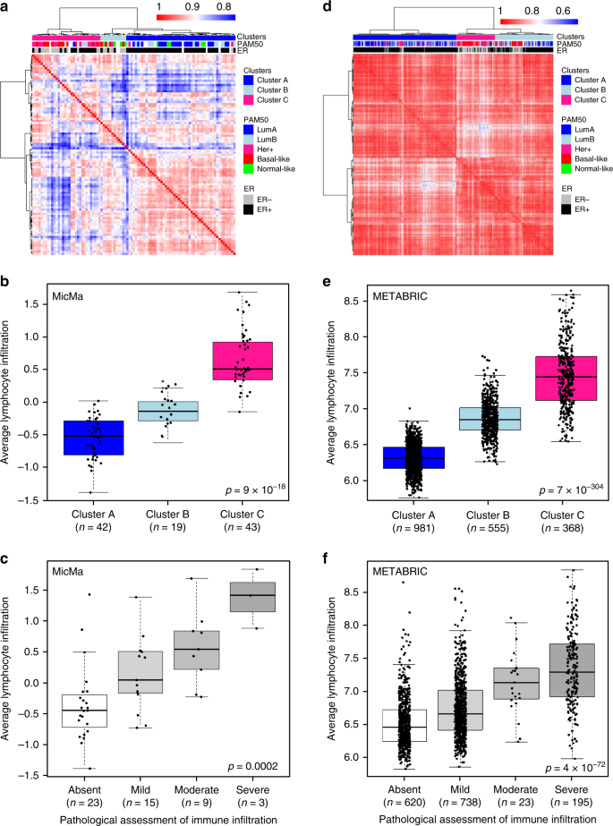
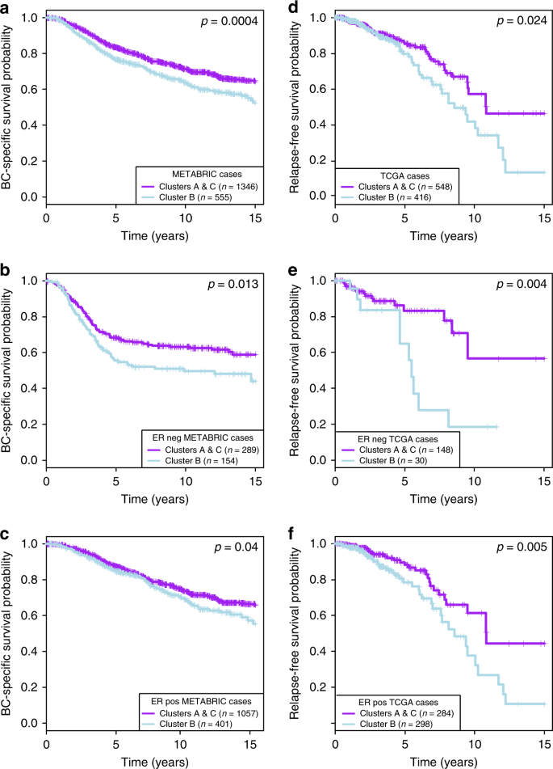
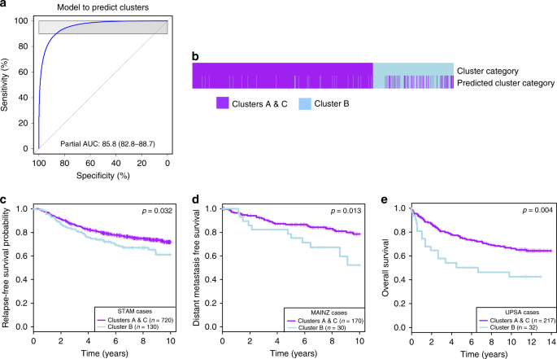
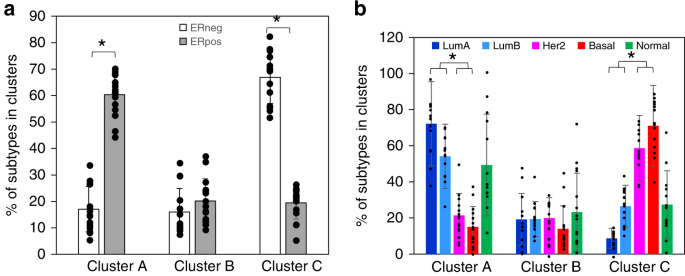
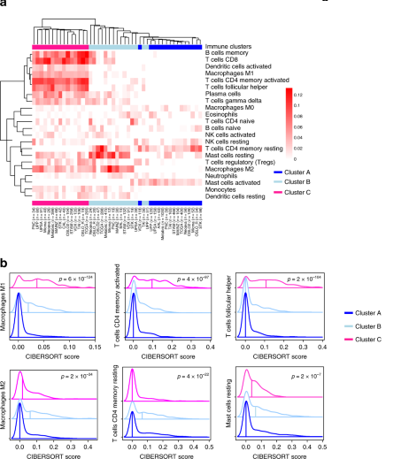

# An independent poor-prognosis subtype of breast cancer defined by a distinct tumor immune microenvironment


Xavier Tekpli, Tonje Lien, Andreas Hagen Røssevold, Daniel Nebdal, Elin Borgen,
Hege Oma Ohnstad, Jon Amund Kyte, Johan Vallon-Christersson, Marie Fongaard, Eldri Undlien Due,
Lisa Gregusson Svartdal, My Anh Tu Sveli, Øystein Garred, OSBREAC, Arnoldo Frigessi,
Kristine Kleivi Sahlberg, Therese Sørlie, Hege G. Russnes, Bjørn Naume & Vessela N. Kristensen

Department of Cancer Genetics, Institute for Cancer Research, **Oslo University Hospital**, Oslo, Norway. <br>

Division of Oncology and Pathology, Department of Clinical Sciences Lund, Faculty of Medicine, **Lund University** <br>
Centre for Cancer Biomarkers CCBIO, Bergen, Norway <br>

Institute of Clinical Medicine, University of Oslo, Oslo, Norway <br>

Department of Clinical Molecular Biology, Division of Medicine, **Akershus University Hospital**, Lørenskog

**Journal Name**: Nature Communications <br>
**Impact Factor** : 14.92

[other articles](https://pubmed.ncbi.nlm.nih.gov/?term=Kristensen%20VN&cauthor_id=31796750)

## Research Question
How mixtures of immune cells associate with cancer cell phenotype and affect pathogenesis is still unclear

## Introduction
In breast cancer, clinicopathological characteristics such as **age, grade, stage, and molecular subtypes** associate with prognosis and drive treatment decisions.

High-throughput gene expression analyses led to a five clinically relevant molecular subtypes:<br>
<br>
**Luminal A, <br><br> Luminal B, <br><br>Her2-enriched, <br><br>Basallike,<br><br> Normal-like**, <br><br>have different incidences, survival, prognosis, and tumor biology.
<br><br>
Such patient stratification has clinical and economical utility in breast cancer management

#### Tumor Microenvironment (TME)

- **The tumor microenvironment influences cancer initiation and progression**
- **Recognize and inhibit tumor growth or promote progression**
- **Crucial to characterize the quality and quantity of immune response at the tumor site**
- **pinpoint patients who could benefit from immunotherapies**

<br>

- In breast cancer, **high immune infiltration** has been associated with better clinical outcome
- High **CD8+ T cell infltration** associate with better overall survival (OS) in estrogen receptor **(ER) negative** patients.
- High immune infiltration is associated with an increased response to **neo-adjuvant and adjuvant chemotherapy**


```python

```

## Materials & Methods

The present study, deals with identification of clinically relevant **immune clusters** with gradual immune infiltration. 

### Gene Expression Data

The data included, FFPE samples, fresh frozen as well as from public domains such as TCGA and METABRIC.

- OSLO1 (FFPE) samples : Nanostring PanCancer Immune Profiling Panel
- Operable early breast cancer patients were included in the OSLO1 micrometastasis observational study between 1995 and 1998
- MicMa cohort (n = 96)
- OSL2 breast cancer cohort (RNASeq) {GSE135298}
- Publically available data <br>**Gene Expression Omnibus <br> European Genome-phenome Archive <br>ArrayExpress, <br> TCGA data portals**.

### Gene set enrichment analysis
- Molecular Signatures Database v4.0 (MSigDB31) H and C2 collections

### Unsupervised clustering to obtain immune clusters
Hierarchial clustering based on the expression of the 760 genes in the nCounter® PanCancer Immune Profiling Panel
To determine the optimal number of clusters for each cohort, the silhouette analysis of KMeans was used.

### Nanodissect analysis, lymphoid and myeloid scores

### CIBERSORT analysis
CIBERSORT is a deconvolution algorithm that uses a set of reference gene expression values (547 genes) to predict 22 immune cell type proportions from bulk tumor sample expression data by using support vector regression

### Binomial logistic regression to predict immune clusters
### Statistical, survival, multivariable Cox regression analysis


## Results

### Immune clusters in breast cancer

- Silhouette analysis from 3 to 10 clusters indicated that 3 clusters captured best the segmentation 
- Hierachial clustering was done on 760 genes in the nCounter® PanCancer Immune Profiling Panel




Immune clusters are associated with total immune infiltration. a, d Gene expression was measured in 95 FFPE MicMa (a) and 1904 fresh frozen METABRIC samples (d). Unsupervised clustering using correlation distance and ward. D linkage of the correlation matrix assesses the relation between patients according to the expression of the genes on the PanCancer Immune Profiling array. All 760 genes on the array were used for clustering the MicMa cohort, while 509 genes, which corresponds to genes (out of the 760) found in all datasets, were used to cluster the METABRIC. Annotations of the samples on the top of the heatmap indicate histopathological features: PAM50 subtype, ER status as well as the three clusters identified by the cutree method. b, e In the MicMa (b) and the METABRIC (e), lymphoid scores quantify lymphoid infiltration which was calculated from a set of genes’ markers of lymphocyte as defined by the algorithm Nanodissect. Lymphoid scores are represented in boxplots according to immune clusters with Kruskal–Wallis test p values. c, f H&E-stained tumor tissue samples (c, MicMa, n = 50 and f, METABRIC, n = 1904) were categorized by an experienced pathologist according to the level of tumor-infiltrating immune cells. Boxplots represent the average lymphocyte score from Nanodissect according to pathologists’ classifications. Kruskal–Wallis test p values is denoted. The line within each box represents the median. Upper and lower edges of each box represent 75th and 25th percentile, respectively. The whiskers represent the lowest datum still within [1.5 × (75th − 25th percentile)] of the lower quartile, and the highest datum still within [1.5 × (75th − 25th percentile)] of the upper quartile.

**unsupervised hierarchical clustering using genes of the PanCancer Immune Profiling array allows to group breast cancer tumors according to gradual levels of immune infiltration.**


### Immune clusters associate with prognosis

Immune clusters are associated with prognosis. Kaplan–Meier survival curves for Cluster B (light blue) and Clusters A and C (purple). In all METABRIC (a) and TCGA (d) samples; in ER negative (b, e) and ER positive (c, f). p values are from log-rank tests. Kaplan–Meier display breast cancer-specific survival for the METABRIC and relapse-free survival for the TCGA.

We further validated this result in four additional cohorts with relevant survival data: TAI (n = 327), VDX (n = 344), STK (n = 159), and UPP (n = 251) (Supplementary Fig. 4). We concluded that immune clusters associate with prognosis both in ER-negative and ER-positive breast cancers.


```python

```

### Predicting immune clusters with binomial logistic regression



Prediction of Cluster B using binomial logistic regression. a Using binomial logistic regression penalized by the lasso method, we trained on 4546 samples to predict Cluster B. ROC curve assesses how the lasso output (the weighted gene sets in Supplementary Data 1) discriminates a sample to be Cluster B or not. b For the 4546 samples in the training set, the heatmap represents whether a sample is part of Cluster B (light blue) or Clusters A and C (purple), using the clustering or the lasso methods. c–e The prediction of the clusters (lasso) was tested on five cohorts, which were not included in the training phase: c STAM (n = 856), d MAINZ (n = 200), and e UPSA (n = 289) are presented here, the two other cohorts CAL and PNC are presented in Supplementary Figures. The association between predicted clusters and survival was tested using Kaplan–Meier survival curves for predicted Cluster B (light blue) and predicted Clusters A and C (purple). p values are from log-rank tests. Kaplan–Meier display relapse-free survival for STAM, distant metastasis-free survival for MAINZ, and overall survival for UPSA.


### Immune clusters, an independent prognostic factor




```python

```

### In silico dissection of the immune clusters



```python

```

### Phenotypic analysis of the immune clusters

To further characterize the phenotype associated with the poor prognosis in Cluster B, we identified through differential gene expression analysis the genes significantly overexpressed in Cluster B. We found 909 genes upregulated in Cluster B when compared to Cluster A and Cluster C separately (Bonferroni-corrected p value < 0.0001; Supplementary Data 3). These genes were associated with stem cell biology and EMT, as shown by the gene set enrichment analysis (GSEA) using the H and C2 collection of the MsigDB


```python

```


```python

```


```python

```


```python

```


```python

```

