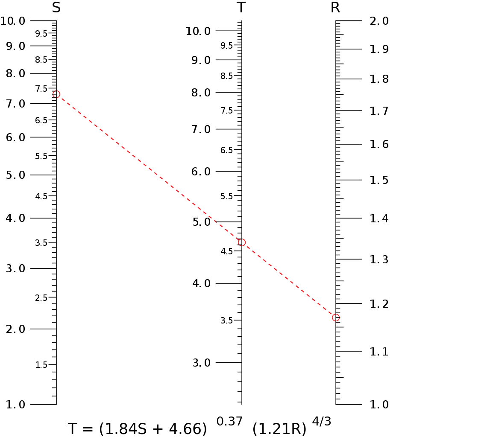
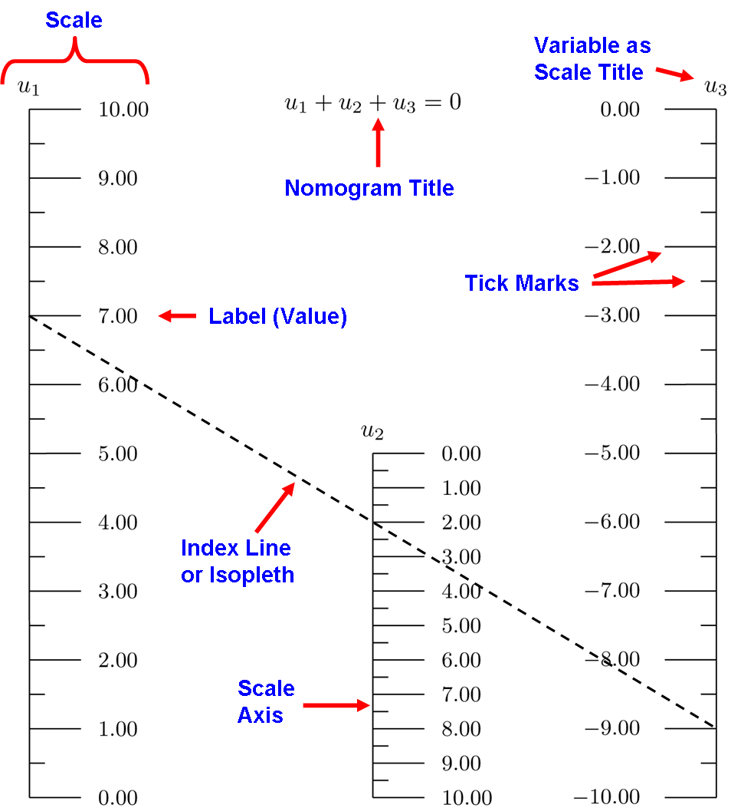
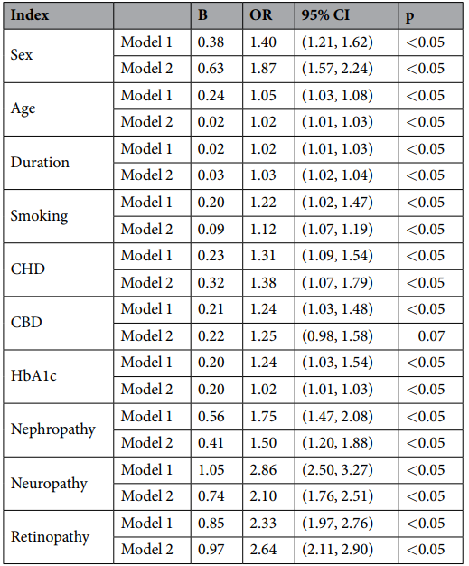
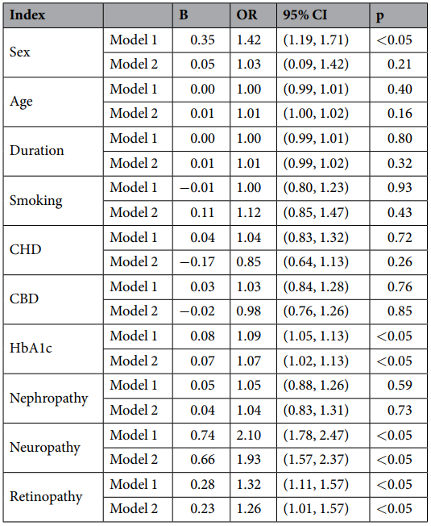
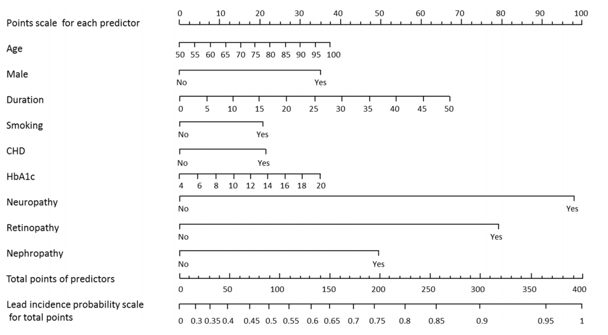
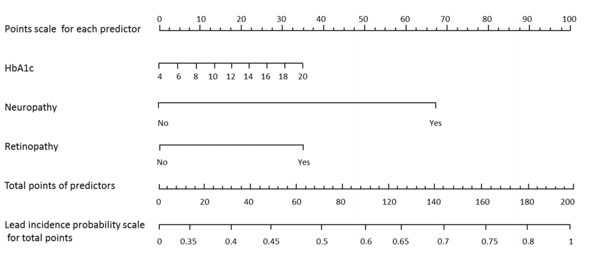
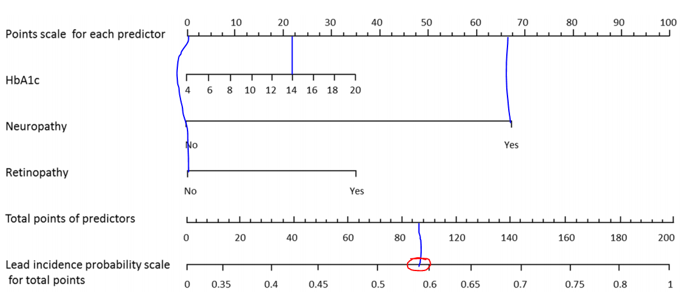

```python

```


```python

```

### Nomogram
A nomogram, also called a nomograph, alignment chart, or abaque, is a graphical calculating device, a two-dimensional diagram designed to allow the approximate graphical computation of a mathematical function. <br>

- The field of nomography was invented in 1884 by the French engineer Philbert Maurice d'Ocagne <br><br>

- A nomogram consists of a set of n scales, one for each variable in an equation. <br><br>
- Knowing the values of n-1 variables, the value of the unknown variable can be found, or by fixing the values of some variables, the relationship between the unfixed ones can be studied. <br><br>
- The result is obtained by laying a straightedge across the known values on the scales and reading the unknown value from where it crosses the scale for that variable.<br><br>
- The virtual or drawn line created by the straightedge is called an index line or isopleth



A nomogram for a three-variable equation typically has three scales, although there exist nomograms in which two or even all three scales are common. Here two scales represent known values and the third is the scale where the result is read off.
The simplest such equation is u1 + u2 + u3 = 0 for the three variables u1, u2 and u3



### Simple-to-use nomogram for evaluating the incident risk of moderate-to-severe LeAD in adults with type 2 diabetes: A cross-sectional study in a chinese population

Journal Name : **Nature Scientific Reports** <br>
Authors: **Xin Zhao, Xiaomei Zhang, Xingwu Ran, Zhangrong Xu & Linong Ji**<br>


Department of Endocrinology, Peking University International Hospital, Beijing, 100001, China.<br>
Department of Endocrinology, West China Hospital, Sichuan University, Sichuan, 610041, China.<br>
Diabetes Center, Department of Endocrinology, The 306th Hospital of PLA, Beijing, 100001, China.<br>
Department of Endocrinology, Peking University People’s Hospital, Beijing, 100001, China.<br>

**Aim**<br>
This study aimed to analyze the clinical characteristics of lower extremity atherosclerotic disease (LEAD) in Chinese adult type 2 diabetes (T2D) patients, and also explored the risk factors for LEAD and developed simple-to-use nomograms for LeAD and lesion degree in these patient

- Retrospectively studied `4422` patients (`male=2084`; `female= 2338`) with `T2D` who were `≥50`. <br><br>
- Based on lower extremity arterial ultrasound findings, we divided the patients into three groups: `normal`, `mild`, and `moderateto-severe` group <br><br>
- The `normal`, `mild LEAD`, and `moderate-to-severe LEAD` groups consisted of `1779`, `1242`, and `1401` patients, respectively 


**Table 1**: Comparison of general baseline characteristics among the three patient groups.<br>
BMI, body mass index; SBP, systolic blood pressure; DBP, diastolic blood pressure, HbA1c, glycosylated hemoglobin; TC, total
cholesterol; TG, triglyceride; LDL-C, low-density lipoprotein cholesterol; HDL-C, high-density lipoprotein
cholesterol; UA, uric acid; BUN, blood urea nitrogen; eGFR, estimated glomerular filtration rate; CHD,
coronary heart disease; CBD, cerebrovascular disease.

#### Analysis of risk factors for LeAD and moderate-to-severe LeAD.

`Multicollinearity analysis` was used for univariate logistic regression analysis of patients’ baseline characteristics (age, gender, diabetes duration, smoking, HbA1c, CHD, CBD, diabetic nephropathy, diabetic retinopathy, and diabetic neuropathy). <br><br>
No collinearity was identified among the factors, and the variance inflation factor (VIF) was <5 for all factors.

`Multivariate logistic regression` analysis was performed with LEAD as a dependent variable and baseline characteristics (age, gender, diabetic duration, smoking, HbA1c, CHD, CBD, diabetic nephropathy, diabetic retinopathy, and diabetic neuropathy) as independent variables. <br>

The risk factors for LEAD included:<br>
male gender(OR=1.87, 95CI% 1.57–2.29),<br>
advanced age (OR =1.02 95CI% 1.01–1.03),<br>
longer diabetic duration (OR =1.03 95CI% 1.02–1.03),<br>
smoking (OR = 1.12 95CI% 1.07–1.19),<br>
higher HbA1c level (OR = 1.02 95CI% 1.01–1.03 CHD (OR = 1.38 95CI% 1.07–1.79),<br>
diabetic nephropathy (OR = 1.50 95CI% 1.20–1.88),<br>
diabetic neuropathy (OR = 2.10 95CI% 1.76–2.51),<br>
and diabetic retinopathy (OR = 2.64 95CI% 2.11–2.90).<br>
These data indicate associations with the risk of LEAD in patients with T2D after adjustment for BMI, blood pressure (BP), lipid levels, and eGFR (Table 2).

**Multivariate logistic regression analysis for risk of LEAD**
<br>
CHD, coronary heart disease; CBD, cerebrovascular disease.<br>
Model 1 is adjusted for BMI, and <br> Model 2 is adjusted for BMI, BP, TC, TG, LDLC, HDL-C, and eGFR.



```python

```

**Multivariate logistic regression analysis for risk of moderate-to-severe LEAD.** <br>
CHD, coronary heart disease; CBD, cerebrovascular disease. <br>
Model 1 is adjusted for BMI, and <br> Model 2 is adjusted for BMI, BP, TC, TG, LDL-C, HDL-C, and eGFR.


#### Predictive accuracy of nomograms for LEAD and moderate-to-severe LEAD in T2D patients.

**Nomogram for LEAD in patients with T2D**



**Accuracy**
The overall predictive accuracy of the nomogram for LEAD was 0.793 (95%CI 0.720, 0.824), and the sensitivity and specificity were 0.619 and 0.849, respectively.


```python

```

**Nomogram for moderate-to-severe LEAD in patients with T2D LEAD**


<br>
**Accuracy** The overall predictive accuracy of the nomogram for moderate-to-severe LEAD was 0.736 (95%CI 0.678, 0.795), and the sensitivity and specificity were 0.792 and 0.60, respectively.


```python

```

**interpretation**




```python

```


```python

```


```python

```
