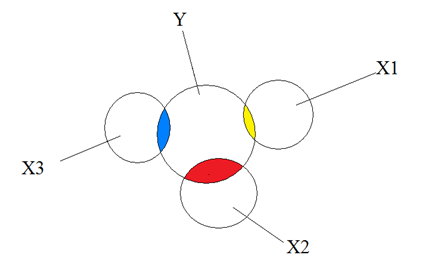
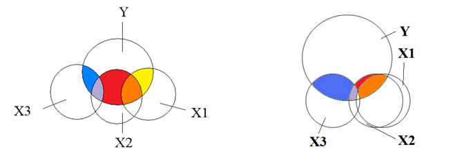
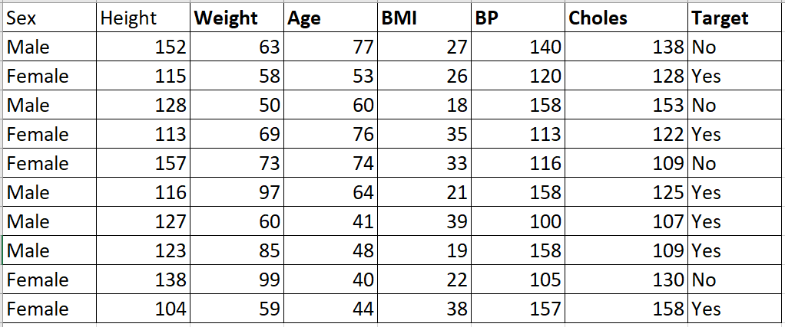
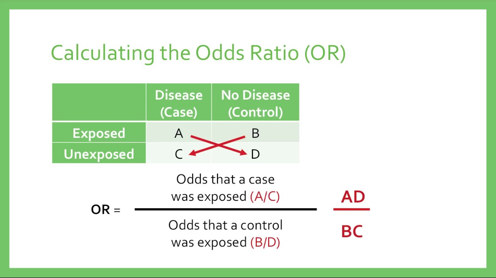

```python

```

### Multicollinearity analysis

In statistics, multicollinearity (also collinearity) is a phenomenon in which one predictor variable in a multiple regression model can be linearly predicted from the others with a substantial degree of accuracy

#### No Multicollinearity

<br>

#### Multicollinearity

<br>


Multicollinearity can be a problem in a regression model because we would not be able to distinguish between the individual effects of the independent variables on the dependent variable.

**Variance Inflation Factor (VIF)**<br>
VIF determines the strength of the correlation between the independent variables. It is predicted by taking a variable and regressing it against every other variable.

or

VIF score of an independent variable represents how well the variable is explained by other independent variables.

### Regression





Regression Analysis is a statistical process for estimating the relationships between the dependent variables or criterion variables and one or more independent variables or predictors. Regression analysis explains the changes in criterions in relation to changes in select predictors

### Logistic Regression
Logistic regression is used when the dependent variable is dichotomous. Logistic regression estimates the parameters of a logistic model and is form of binomial regression. Logistic regression is used to deal with data that has two possible criterions and the relationship between the criterions and the predictors

#### Odds Ratio
An odds ratio (OR) is a statistic that quantifies the strength of the association between two events, A and B.


Odds ratios are used to compare the relative odds of the occurrence of the outcome of interest (e.g. disease or disorder), given exposure to the variable of interest (e.g. health characteristic, aspect of medical history). The odds ratio can also be used to determine whether a particular exposure is a risk factor for a particular outcome, and to compare the magnitude of various risk factors for that outcome.

OR=1 Exposure does not affect odds of outcome

OR>1 Exposure associated with higher odds of outcome

OR<1 Exposure associated with lower odds of outcome




**Sensitivity** (True Positive rate) measures the proportion of positives that are correctly identified (i.e. the proportion of those who have some condition (affected) who are correctly identified as having the condition).<br>
**Specificity** (True Negative rate) measures the proportion of negatives that are correctly identified (i.e. the proportion of those who do not have the condition (unaffected) who are correctly identified as not having the condition).<br>


```python

```


```python

```


```python

```
